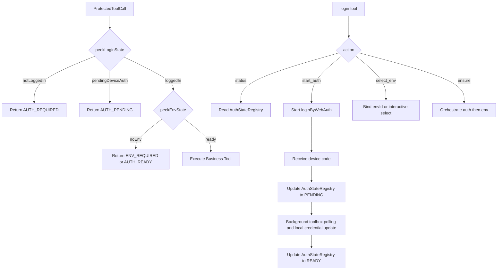

# CloudBase MCP 认证流程总体验证与改造计划

## 评审结论

当前设计已经在 `[/Users/bookerzhao/Projects/cloudbase-turbo-delploy/mcp/src/tools/env.ts](`/Users/bookerzhao/Projects/cloudbase-turbo-delploy/mcp/src/tools/env.ts`)` 中形成了较清晰的 `login` tool 动作模型：`status`、`start_auth`、`select_env`、`ensure`。但大多数业务 tool 仍通过 `[/Users/bookerzhao/Projects/cloudbase-turbo-delploy/mcp/src/cloudbase-manager.ts](`/Users/bookerzhao/Projects/cloudbase-turbo-delploy/mcp/src/cloudbase-manager.ts`)` 隐式进入 `getLoginState() -> loginByWebAuth() -> envManager.getEnvId() -> _promptAndSetEnvironmentId()` 的长阻塞链路，这与 `login` tool 的结构化协议已经出现明显分叉。

从 AI Agent 可编排性、协议清晰度和 headless/device flow 可见性来看，推荐目标设计是：

- `login` tool 成为唯一负责“发起认证 / 驱动环境选择”的显式入口。
- 其他受保护 tool 在未登录或未选环境时默认快速失败，返回统一的结构化引导结果，而不是隐式拉起登录页面或交互页面。
- Device Flow 进入 `AUTH_PENDING` 后，系统需要有可查询的“认证进行中”状态，而不是只依赖一次性的 tool 返回。

## 当前关键问题

- `[/Users/bookerzhao/Projects/cloudbase-turbo-delploy/mcp/src/auth.ts](`/Users/bookerzhao/Projects/cloudbase-turbo-delploy/mcp/src/auth.ts`)` 的 `getLoginState()` 名义上像“读取状态”，实际上在未登录时会直接 `await loginByWebAuth(...)`，这是最大的语义污染点。
- `[/Users/bookerzhao/Projects/cloudbase-turbo-delploy/mcp/src/cloudbase-manager.ts](`/Users/bookerzhao/Projects/cloudbase-turbo-delploy/mcp/src/cloudbase-manager.ts`)` 中 `getCloudBaseManager()` 默认要求环境就绪，因此任意业务 tool 都可能无意间进入登录+选环境的阻塞流程。
- `[/Users/bookerzhao/Projects/cloudbase-turbo-delploy/mcp/src/tools/interactive.ts](`/Users/bookerzhao/Projects/cloudbase-turbo-delploy/mcp/src/tools/interactive.ts`)` 的 `_promptAndSetEnvironmentId()` 既做登录检查，又做 TCB 初始化、环境查询、自动创建、交互选择，职责过重，不利于快速失败。
- Device Flow 虽然在 `login(action="start_auth", authMode="device")` 中已经能做到“拿到 device code 立刻返回”，但其他 tool 并不知道当前是否处于 `AUTH_PENDING`，也拿不到 `auth_challenge`。
- 文档与设计稿未形成完整闭环：`[/Users/bookerzhao/Projects/cloudbase-turbo-delploy/doc/mcp-tools.md](`/Users/bookerzhao/Projects/cloudbase-turbo-delploy/doc/mcp-tools.md`)` 只写了 `login` 输入参数，没把 `AUTH_REQUIRED` / `AUTH_PENDING` / `AUTH_READY` / `READY` / `NO_ENV` / `next_step` / `env_candidates` 这些输出契约正式写清。
- 契约命名不统一：设计稿中存在 `env_id`，代码外部参数是 `envId`，候选项里又是 `env_id`。这会直接降低 AI 调用成功率。

## 推荐设计方向

### 1. 拆分“读状态”和“保证状态”

在 `[/Users/bookerzhao/Projects/cloudbase-turbo-delploy/mcp/src/auth.ts](`/Users/bookerzhao/Projects/cloudbase-turbo-delploy/mcp/src/auth.ts`)` 中把当前 `getLoginState()` 的双重职责拆开：

- `peekLoginState()`：纯读取，不触发登录。
- `ensureLogin()`：显式触发 `loginByWebAuth()`，仅由 `login` tool 或明确交互入口调用。

同理，环境层也应区分：

- `peekEnvState()`：只看缓存、环境变量、当前登录态里的 `envId`、候选环境列表。
- `ensureEnvSelected()`：显式进入 `_promptAndSetEnvironmentId()`。

这一步是整个设计收敛的根基，否则“快速失败”与“自动帮助完成流程”会一直混在一起。

### 2. 统一受保护 tool 的 auth gate

在所有依赖 `getCloudBaseManager()` 的业务 tool 前统一增加认证门禁，默认策略为 `fail_fast`：

- 若未登录：返回 `AUTH_REQUIRED`，并显式指向 `login` tool。
- 若设备码授权进行中：返回 `AUTH_PENDING`，附带最近一次 `auth_challenge` 与轮询建议。
- 若已登录但未选环境：返回 `ENV_REQUIRED` 或继续复用 `AUTH_READY + next_step=select_env`，但要统一一个协议。
- 仅 `login`、`logout`、少数纯状态查询 tool 允许绕过该门禁。

推荐统一返回结构：

```json
{
  "ok": false,
  "code": "AUTH_REQUIRED",
  "message": "当前未登录，请先调用 login 工具完成认证。",
  "next_step": {
    "tool": "login",
    "action": "start_auth",
    "suggested_args": {
      "action": "start_auth",
      "authMode": "device"
    }
  }
}
```

这里的关键不是只返回 `action`，而是返回 `tool + action + suggested_args`，否则普通 AI 仍可能不知道这一步是要调哪个工具。

### 3. 为 Device Flow 增加“进行中状态”注册表

当前 `start_auth(device)` 已经能快速返回，但后台认证状态没有全局可读来源。建议新增轻量状态注册层，例如放在 `[/Users/bookerzhao/Projects/cloudbase-turbo-delploy/mcp/src/auth.ts](`/Users/bookerzhao/Projects/cloudbase-turbo-delploy/mcp/src/auth.ts`)` 或独立模块中，保存：

- `status`: `IDLE | PENDING | READY | DENIED | EXPIRED | ERROR`
- `authChallenge`: `user_code`, `verification_uri`, `expires_in`, `issued_at`
- `lastError`
- `resolvedLoginState` 或是否已写入本地 credential

这样：

- `login(action="start_auth")` 可以写入 `PENDING`。
- `login(action="status")` 可以读取真实 pending 状态，而不是只看 `AuthSupevisor.getLoginState()`。
- 其他业务 tool 在未登录但存在 pending auth 时，可以返回 `AUTH_PENDING`，同时把 device code 再告诉 AI 一次，避免“只在第一次返回里出现一次”的问题。

### 4. 让 `login` tool 成为唯一有副作用的编排入口

建议把 `login` 四个动作语义最终定死：

- `status`：纯读，绝不触发认证或环境选择。
- `start_auth`：只发起认证。`device` 模式收到 device code 即返回 `AUTH_PENDING`；`web` 模式可选择阻塞到完成，或也改为统一进入 `PENDING`。
- `select_env`：只做环境绑定。传 `envId` 时走快速路径；未传时允许进入交互选择。
- `ensure`：显式 orchestration。依序执行“检查状态 -> 必要时提示先 start_auth -> 必要时 select_env -> 最终 READY”。

也就是说，`ensure` 是唯一可以串联多个动作的便捷入口；其他业务 tool 不再隐式调用它。

### 5. 统一错误码与字段命名

需要收敛以下契约差异：

- 对外输入字段统一用 `envId`，不要再在文档或 `required_params` 中出现 `env_id`。
- `env_candidates` 内部如果为了兼容历史数据保留 `env_id`，也建议额外补 `envId`，或干脆统一转成 `envId`。
- `AUTH_READY`、`ENV_READY`、`READY` 的语义需要在文档里明确分层：
  - `AUTH_READY`: 已登录
  - `ENV_READY`: 已绑定环境
  - `READY`: 登录与环境都就绪
- 补齐真正实现的状态码和流程，而不是保留未实现的 `MULTIPLE_ENV`、`INVALID_ACTION` 之类“设计稿存在、代码未落地”的项。

## 目标流程图




## 具体执行工作流

### 工作流 A：设计收敛

聚焦以下文件并先统一规格：

- `[/Users/bookerzhao/Projects/cloudbase-turbo-delploy/specs/mcp-device-auth/design.md](`/Users/bookerzhao/Projects/cloudbase-turbo-delploy/specs/mcp-device-auth/design.md`)`
- `[/Users/bookerzhao/Projects/cloudbase-turbo-delploy/specs/mcp-device-auth/requirements.md](`/Users/bookerzhao/Projects/cloudbase-turbo-delploy/specs/mcp-device-auth/requirements.md`)`
- `[/Users/bookerzhao/Projects/cloudbase-turbo-delploy/doc/mcp-tools.md](`/Users/bookerzhao/Projects/cloudbase-turbo-delploy/doc/mcp-tools.md`)`

输出内容：

- 明确“其他业务 tool 默认快速失败并引导 `login` tool”是正式策略。
- 明确 `login` 是唯一有副作用的认证入口。
- 明确 Device Flow pending 的跨 tool 可见协议。
- 明确统一命名、状态码和 `next_step` 结构。

### 工作流 B：认证/环境状态层重构

目标文件：

- `[/Users/bookerzhao/Projects/cloudbase-turbo-delploy/mcp/src/auth.ts](`/Users/bookerzhao/Projects/cloudbase-turbo-delploy/mcp/src/auth.ts`)`
- `[/Users/bookerzhao/Projects/cloudbase-turbo-delploy/mcp/src/cloudbase-manager.ts](`/Users/bookerzhao/Projects/cloudbase-turbo-delploy/mcp/src/cloudbase-manager.ts`)`
- `[/Users/bookerzhao/Projects/cloudbase-turbo-delploy/mcp/src/tools/interactive.ts](`/Users/bookerzhao/Projects/cloudbase-turbo-delploy/mcp/src/tools/interactive.ts`)`

目标改造：

- 增加纯读 API：`peekLoginState()` / `peekEnvState()`。
- 保留显式副作用 API：`ensureLogin()` / `ensureEnvSelected()`。
- 引入 `AuthStateRegistry`，持久化当前 pending challenge。
- 为 `getCloudBaseManager()` 增加策略参数，例如 `authStrategy: "fail_fast" | "ensure"`，默认给业务 tool 使用 `fail_fast`。

### 工作流 C：统一业务 tool 门禁

目标文件：所有通过 `getCloudBaseManager()` 获取 manager 的工具模块，例如：

- `[/Users/bookerzhao/Projects/cloudbase-turbo-delploy/mcp/src/tools/functions.ts](`/Users/bookerzhao/Projects/cloudbase-turbo-delploy/mcp/src/tools/functions.ts`)`
- `[/Users/bookerzhao/Projects/cloudbase-turbo-delploy/mcp/src/tools/storage.ts](`/Users/bookerzhao/Projects/cloudbase-turbo-delploy/mcp/src/tools/storage.ts`)`
- `[/Users/bookerzhao/Projects/cloudbase-turbo-delploy/mcp/src/tools/hosting.ts](`/Users/bookerzhao/Projects/cloudbase-turbo-delploy/mcp/src/tools/hosting.ts`)`
- `[/Users/bookerzhao/Projects/cloudbase-turbo-delploy/mcp/src/tools/databaseNoSQL.ts](`/Users/bookerzhao/Projects/cloudbase-turbo-delploy/mcp/src/tools/databaseNoSQL.ts`)`
- `[/Users/bookerzhao/Projects/cloudbase-turbo-delploy/mcp/src/tools/databaseSQL.ts](`/Users/bookerzhao/Projects/cloudbase-turbo-delploy/mcp/src/tools/databaseSQL.ts`)`
- 以及其他依赖 `getCloudBaseManager()` 的模块

目标改造：

- 所有受保护 tool 使用统一 auth gate。
- 未登录/认证中/未选环境时返回同一类结构化错误，而不是各自进入交互流程或抛裸异常。
- `cloudBaseOptions` 旁路模式需要单独定义规则，避免绕过统一门禁后出现更难理解的失败。

### 工作流 D：测试补齐

优先补齐以下测试：

- `[/Users/bookerzhao/Projects/cloudbase-turbo-delploy/mcp/src/tools/env.test.ts](`/Users/bookerzhao/Projects/cloudbase-turbo-delploy/mcp/src/tools/env.test.ts`)`：
  - `start_auth + device` 返回 `AUTH_PENDING + auth_challenge + next_step.tool=login`
  - `status` 能读取 pending device auth
  - `ensure` 在未登录、已登录未选环境、全部就绪三种状态下的返回
  - `envId` / `env_candidates` 命名契约
- 至少新增一个非 `login` tool 的 auth gate contract test，验证未登录快速失败并明确引导 `login`。
- 补齐 `AUTH_REQUIRED`、`AUTH_PENDING`、`AUTH_DENIED`、`AUTH_EXPIRED`、`NO_ENV`、`USER_CANCELLED`、`INTERNAL_ERROR` 的错误映射测试。

### 工作流 E：对外文档补齐

在 `[/Users/bookerzhao/Projects/cloudbase-turbo-delploy/doc/mcp-tools.md](`/Users/bookerzhao/Projects/cloudbase-turbo-delploy/doc/mcp-tools.md`)` 里新增一节“认证前置与统一失败协议”，明确：

- 任何受保护 tool 在未登录时不会隐式拉起登录，而会返回结构化引导。
- AI 推荐调用：`login(action="start_auth")`、`login(action="status")`、`login(action="select_env", envId="...")`、`login(action="ensure")`。
- 返回中的 `next_step.tool`、`next_step.action`、`suggested_args` 是给 AI 直接执行的协议字段。

## 实施顺序建议

1. 先改规格和文档，把边界定死。
2. 再拆 `auth.ts` / `cloudbase-manager.ts` 的职责。
3. 然后接入统一 auth gate 到业务 tool。
4. 最后补测试并做一轮回归，重点看 device flow、未登录直调业务 tool、已登录未选环境、显式 `cloudBaseOptions` 模式。

## 需要重点关注的风险

- 背景执行的 `loginByWebAuth()` 如果缺少 pending registry，只能靠第一次 tool 返回暴露 device code，其他 tool 无法感知认证进行中。
- `interactive.ts` 当前职责过重，若不先拆边界，很容易在“快速失败”和“自动帮助完成流程”之间反复打架。
- `currentResolver`、`process.env.CLOUDBASE_ENV_ID`、缓存 envId 都是全局状态，多会话并发场景下可能串状态；这部分至少要在设计里标明约束。
- `clientId`、notice channel、`envId/env_id` 等遗留不一致项如果不一并收敛，AI 端成功率仍会受影响。

