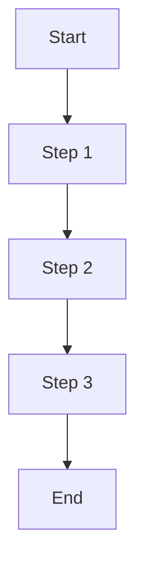

## Source commands (migrated from `.cursor/commands/`)

### create_doc.md

```md
# Create Documentation

## Function
Create comprehensive documentation following Diátaxis framework and OpenAgentKit standards

## Trigger Condition
When user inputs `/create-doc`

## Behavior
Guide users through creating documentation that follows both Diátaxis framework principles and OpenAgentKit documentation standards

## Process Flow

### Step 1: Documentation Type Selection
Use `/doc-type` to determine the correct documentation type:
- Tutorial (Learning + Doing)
- How-to Guide (Working + Doing)  
- Reference (Working + Understanding)
- Explanation (Learning + Understanding)

### Step 2: Content Planning
- [ ] Create mind map of reader goals and use cases
- [ ] Define target audience and their knowledge level
- [ ] Plan information architecture and navigation
- [ ] Identify key concepts and examples needed

### Step 3: Structure Creation
Based on documentation type, use appropriate template:
- `/tutorial` for learning-oriented content
- `/howto` for task-oriented content
- `/reference` for information-oriented content
- `/explanation` for understanding-oriented content

### Step 4: Content Writing
Apply Diátaxis writing principles:
- [ ] "Face-to-face" principle - write conversationally
- [ ] Zero knowledge assumption - define all terms
- [ ] Pyramid principle - most important first
- [ ] Hemingway clarity - short, active sentences
- [ ] Include multimedia elements - diagrams, code examples

### Step 5: Frontmatter Configuration
Ensure proper MDX frontmatter:
```yaml
---
title: "[Page Title]"
description: "[Brief description for SEO]"
---
```

### Step 6: Quality Review (MANDATORY)
- [ ] **Existence Verification**: Verify every function, package, and API endpoint exists in codebase
- [ ] **No Fabricated Content**: Ensure no fake CLI commands, non-existent configs, or made-up features
- [ ] **Preview Marking**: All incomplete features must be marked with "*Coming soon*" or "*In development*"
- [ ] **Code Validation**: Test all code examples are runnable and accurate
- [ ] **Reality Check**: Question if features seem too advanced for project maturity
- [ ] **Diátaxis Compliance**: Verify content type and structure appropriateness
- [ ] **Cross-Reference Validation**: Test all internal and external links

## Integration with OpenAgentKit Standards

### Required Elements
- **Title**: Clear, descriptive title in frontmatter
- **Structure**: Follow Diátaxis framework for content organization
- **Language**: English for all technical content
- **Examples**: Include practical, runnable code samples
- **Accuracy**: All code examples must be verified against actual codebase
- **Honesty**: No fabricated functionality - use "*Coming soon*" for incomplete features

### Optional Enhancements
- **Interactive elements**: Use MDX components when appropriate
- **Multiple language examples**: JavaScript, TypeScript, Python
- **Error handling**: Include error handling in code examples
- **Cross-references**: Link to related documentation

## Usage Examples

```
/create-doc I need to create documentation for our new API authentication system
→ Guide through type selection, structure, and content creation

/create-doc Help me document the agent configuration process
→ Determine if it's tutorial (learning) or how-to (working) based on user needs
```

## Success Criteria (MANDATORY)
- [ ] **Zero Fabricated Content**: No fake CLI commands, non-existent packages, or made-up features
- [ ] **All Code Verified**: Every code example tested against actual codebase
- [ ] **Preview Marking**: All incomplete features clearly marked as "*Coming soon*"
- [ ] **Diátaxis Compliance**: Follows framework principles for content type
- [ ] **OpenAgentKit Standards**: Meets all documentation requirements
- [ ] **User Needs Addressed**: Content effectively serves target audience
- [ ] **Consistent Quality**: Maintains professional tone and structure
```

### doc_type.md

```md
# Documentation Type Selector

## Function
Help users identify the correct Diátaxis documentation type for their content

## Trigger Condition
When user inputs `/doc-type`

## Behavior
Guide users through the Diátaxis framework to determine the most appropriate documentation type for their content

## Diátaxis Framework Decision Tree

### Step 1: Identify User State
**Is the user in Learning mode or Working mode?**

**Learning Mode** (Acquiring new skills/knowledge):
- User is new to the topic
- User wants to understand concepts
- User is building foundational knowledge
- User needs guided learning experience

**Working Mode** (Applying existing knowledge):
- User has basic knowledge of the topic
- User needs to complete specific tasks
- User needs to look up information
- User is solving problems

### Step 2: Identify Knowledge Type
**Is the content about Understanding or Doing?**

**Understanding** (Theoretical knowledge):
- Explaining concepts and principles
- Providing context and background
- Describing how things work
- Information lookup and reference

**Doing** (Practical knowledge):
- Step-by-step instructions
- Hands-on learning
- Task completion
- Problem solving

### Step 3: Determine Documentation Type

```
Learning Mode + Doing = TUTORIAL
Learning Mode + Understanding = EXPLANATION
Working Mode + Doing = HOW-TO GUIDE
Working Mode + Understanding = REFERENCE
```

## Documentation Type Characteristics

### Tutorial (Learning + Doing)
- **Purpose**: Skill acquisition through guided learning
- **Tone**: Instructional, supportive, encouraging
- **Structure**: Progressive learning with hands-on practice
- **Use when**: Teaching new skills, onboarding, educational content

### How-to Guide (Working + Doing)
- **Purpose**: Task completion and problem solving
- **Tone**: Practical, direct, solution-focused
- **Structure**: Direct, actionable steps
- **Use when**: Specific tasks, troubleshooting, operational procedures

### Reference (Working + Understanding)
- **Purpose**: Information lookup and verification
- **Tone**: Neutral, factual, authoritative
- **Structure**: Comprehensive, structured data
- **Use when**: API docs, command references, technical specifications

### Explanation (Learning + Understanding)
- **Purpose**: Concept comprehension and context
- **Tone**: Educational, analytical, thought-provoking
- **Structure**: Conceptual explanation and analysis
- **Use when**: Architecture overviews, concept explanations, background context

## Usage Examples

```
/doc-type I want to help users learn React Hooks from scratch
→ TUTORIAL (Learning + Doing)

/doc-type I need to document how to deploy an application
→ HOW-TO GUIDE (Working + Doing)

/doc-type I want to explain what microservices architecture is
→ EXPLANATION (Learning + Understanding)

/doc-type I need to document API endpoint parameters
→ REFERENCE (Working + Understanding)
```

## Quality Checklist
- [ ] Identified correct user state (Learning vs. Working)
- [ ] Identified correct knowledge type (Understanding vs. Doing)
- [ ] Selected appropriate documentation type
- [ ] Applied correct tone and structure
- [ ] Followed Diátaxis framework principles
```

### explanation.md

```md
# Create Explanation Documentation

## Function
Create understanding-oriented explanation documentation following the Diátaxis framework

## Trigger Condition
When user inputs `/explanation`

## Behavior
Create a document that meets Diátaxis explanation standards, helping users understand concepts, principles, and context

## Diátaxis Classification
- **User State**: Learning mode (seeking understanding)
- **Knowledge Type**: Understanding-oriented (concept comprehension)
- **Purpose**: Deep comprehension and insight

## Explanation Characteristics
- **User State**: Learning mode, seeking understanding
- **Goal**: Deep comprehension and insight
- **Approach**: Conceptual explanation and analysis
- **Focus**: Understanding and context
- **Tone**: Educational, analytical, thought-provoking

## Document Structure Template

```markdown
# [Concept] Explanation

## What is [Concept]
Definition and basic meaning of [concept]

## Why [Concept] is Needed
- [Problem solved 1]
- [Value provided 1]
- [Application scenario 1]

## How [Concept] Works
[Detailed explanation of how the concept works]

### Core Mechanisms
1. [Mechanism 1]: [Detailed explanation]
2. [Mechanism 2]: [Detailed explanation]
3. [Mechanism 3]: [Detailed explanation]

### Workflow


## Related Concepts
- **[Related concept 1]**: [Relationship explanation]
- **[Related concept 2]**: [Relationship explanation]
- **[Related concept 3]**: [Relationship explanation]

## Practical Applications
### Application Scenario 1: [Scenario Name]
- **Background**: [Scenario background]
- **Application**: [How to apply]
- **Effect**: [Expected effect]

### Application Scenario 2: [Scenario Name]
[Repeat above structure]

## Best Practices
- [Practice recommendation 1]
- [Practice recommendation 2]
- [Practice recommendation 3]

## Common Misconceptions
**Misconception 1**: [Incorrect understanding]
**Correct Understanding**: [Correct explanation]

**Misconception 2**: [Incorrect understanding]
**Correct Understanding**: [Correct explanation]

## Further Learning
- [Advanced learning resource 1]
- [Related topic 1]
- [Practice project suggestions]
```

## Writing Guidelines

### 1. Understanding-Oriented
- Focus on promoting understanding
- Provide in-depth analysis and explanation
- Help users build conceptual frameworks

### 2. Depth
- Provide in-depth analysis and explanation
- Explain principles and mechanisms
- Provide rich context

### 3. Contextual
- Provide necessary background knowledge
- Explain the history and development of concepts
- Describe application scenarios and value

### 4. Inspiring
- Inspire user thinking
- Provide different perspectives
- Encourage deep exploration

## Quality Checklist
- [ ] Clear concept definition
- [ ] In-depth principle explanation
- [ ] Rich background information
- [ ] Practical application scenarios
- [ ] Related concept relationships
- [ ] Best practice recommendations
- [ ] Common misconception clarification
- [ ] Further learning resources

## Usage Example

```
/explanation Create an explanation document about microservices architecture
```

This will generate a document to help users deeply understand microservices architecture, including concept definition, working principles, application scenarios, and best practices.
```

### issue.md

```md
# Issue Creation Command

## Function
Create GitHub issues using GitHub CLI with standardized format and proper categorization

## Trigger Condition
When user inputs `/issue` followed by issue description

## Behavior
1. Parse user input to extract issue details
2. Generate standardized issue title and body
3. Use GitHub CLI to create issue with appropriate labels
4. Provide confirmation with issue URL

## Issue Format Standards

### Title Format
- Use clear, descriptive titles
- Start with action verb when applicable
- Keep under 100 characters
- Examples:
  - "Add support for custom model providers"
  - "Fix memory leak in conversation manager"
  - "Improve error handling in tool execution"

### Body Structure
```markdown
## Description
Brief description of the issue or feature request

## Problem/Need
What problem does this solve or what need does it address?

## Proposed Solution
How should this be implemented or resolved?

## Acceptance Criteria
- [ ] Criterion 1
- [ ] Criterion 2
- [ ] Criterion 3

## Additional Context
Any additional information, screenshots, or references
```

### Label Categories
- **bug**: Issues that cause unexpected behavior
- **enhancement**: New features or improvements
- **documentation**: Documentation updates needed
- **performance**: Performance-related issues
- **security**: Security vulnerabilities or concerns
- **breaking-change**: Changes that break existing functionality
- **good-first-issue**: Suitable for new contributors
- **help-wanted**: Community help needed
- **priority-high**: High priority issues
- **priority-medium**: Medium priority issues
- **priority-low**: Low priority issues

## Implementation Steps

1. **Parse Input**: Extract issue type, description, and details from user input
2. **Generate Title**: Create standardized title based on issue type
3. **Format Body**: Structure issue body with required sections
4. **Assign Labels**: Automatically assign appropriate labels
5. **Create Issue**: Use `gh issue create` command
6. **Confirm**: Display created issue URL and details

## GitHub CLI Commands

### Basic Issue Creation
```bash
gh issue create --title "Issue Title" --body "Issue description" --label "bug,priority-medium"
```

### With Assignee
```bash
gh issue create --title "Issue Title" --body "Issue description" --assignee @me --label "enhancement"
```

### With Milestone
```bash
gh issue create --title "Issue Title" --body "Issue description" --milestone "v1.0.0" --label "feature"
```

## Input Examples

### Bug Report
```
/issue Fix memory leak in agent conversation manager causing performance degradation after long sessions
```

### Feature Request
```
/issue Add support for custom model providers to allow integration with local LLM services
```

### Documentation
```
/issue Update API documentation for new streaming response format
```

### Performance Issue
```
/issue Optimize tool execution performance for large batch operations
```

## Quality Checklist
- [ ] Issue title is clear and descriptive
- [ ] Issue body follows standard format
- [ ] Appropriate labels are assigned
- [ ] Acceptance criteria are defined
- [ ] Issue is properly categorized
- [ ] No sensitive information included
- [ ] GitHub CLI is authenticated and working

## Error Handling
- Validate GitHub CLI authentication
- Check repository access permissions
- Handle network connectivity issues
- Provide clear error messages for common failures
- Suggest troubleshooting steps when needed

## Prerequisites
- GitHub CLI installed and authenticated
- Repository access permissions
- Valid GitHub token with issue creation rights
```

### prototype.md

```md
# /prototype - Rapid Prototype Development Mode

## Command Description
Rapid prototype development mode, focusing on quickly validating ideas and concepts. Suitable for MVP development, proof of concept, technical exploration, and other scenarios.

## Work Mode
When using the `/prototype` command, AI will:
1. Quickly understand core requirements
2. Adopt Minimum Viable Product (MVP) strategy
3. Prioritize core functionality implementation
4. Use rapid prototyping technology stack
5. Focus on functionality validation rather than perfect implementation

## Development Principles
- **Rapid Iteration**: Prioritize core functionality implementation, quickly validate ideas
- **Minimum Viable**: Only implement necessary features, avoid over-engineering
- **Technical Simplification**: Use mature and stable technology stack, avoid complex configurations
- **Rapid Deployment**: Prioritize quick deployment and demonstration
- **User Feedback**: Design mechanisms for easy user feedback collection

## Applicable Scenarios
- MVP (Minimum Viable Product) development
- Proof of Concept (PoC)
- Technical exploration and experimentation
- Rapid demonstration prototypes
- User requirement validation
- Technology selection validation
- Rapid functional prototypes

## Development Process

You are a professional frontend development engineer, specializing in creating high-fidelity prototype designs. Your main job is to transform user requirements into interface prototypes that can be directly used for development. Please complete the prototype design of all interfaces through the following methods and ensure that these prototype interfaces can be directly used for development.

1. User Experience Analysis: First analyze the main functions and user needs of this App, determine the core interaction logic.
2. Product Interface Planning: As a product manager, define key interfaces and ensure reasonable information architecture.
3. High-fidelity UI Design: As a UI designer, design interfaces that closely follow real iOS/Android/Web App design standards, using modern UI elements to provide a good visual experience.
4. HTML Prototype Implementation: Use HTML + Tailwind CSS to generate all prototype interfaces, can use FontAwesome to make interfaces more beautiful and closer to real App design. Split code files to maintain clear structure.
5. Each interface should be stored as an independent HTML file, such as home.html, profile.html, settings.html, each interface needs to include its own style script, etc.
- Pages should include basic interactive actions & data logic, not just static content, can be used for actual development.
- Realism Enhancement: Interface dimensions should consider responsiveness, mobile end simulates iPhone 15 Pro, PC end adapts to 1440px width.
- Use real UI images, not placeholder images (can be selected from Unsplash, wikimedia [generally choose 500 size], Pexels, Apple official UI and other resources, choose the most suitable resources, ensure image content matching).

If there are no special requirements, provide at most 4 pages. No need to consider generation length and complexity, ensure the application is rich and practically usable. Please generate complete HTML code according to the above requirements and ensure it can be used for actual development.

IMPORTANT: **Only generate HTML prototypes**, other technology stacks will be implemented in subsequent development. Even if users request React/mini-program project code, treat it as generating an application, only use HTML implementation, not React/mini-program.

I will design a complete high-fidelity mobile application prototype for you, including user experience analysis, interface planning and HTML implementation. Please first tell me what type of App you want to develop or specific requirements, for example:

1. What type of App is this? (Social, e-commerce, tools, content, etc.)
2. What are the main functional requirements?
3. Are there any specific design style preferences?
4. What core business processes need to be supported?

With this information, I can provide you with:
- Complete user experience analysis report
- Detailed product interface planning
- High-fidelity UI design that conforms to iOS/Android design standards
- HTML+Tailwind CSS prototype code that can be directly used for development

Please provide more specific information about the App you want to develop, and I will generate a complete prototype design solution for you.
```

### add_article_tutorial.md

```md
# Add Article Tutorial

## Function
Add a new article tutorial (from Juejin or other platforms) to the TutorialsGrid component, including metadata extraction from article pages.

## Trigger Condition
When user inputs `/add_article_tutorial` or provides an article URL with request to add it as a tutorial

**Default Behavior**: If no article URL is provided, automatically open Juejin search page to browse for new CloudBase articles
```

### add_video_tutorial.md

```md
# Add Video Tutorial

## Function
Add a new Bilibili video tutorial to the TutorialsGrid component, including automatic thumbnail download, cloud storage upload, and metadata extraction.

## Trigger Condition
When user inputs `/add_video_tutorial` or provides a Bilibili video URL with request to add it as a tutorial

**Default Behavior**: If no video URL is provided, automatically open Bilibili search page to browse for new CloudBase videos
```

### add_aiide.md

```md
# Add AI IDE Support

## Function
Add support for a new AI IDE to the CloudBase AI Toolkit project.

## Trigger Condition
When user inputs `/add-aiide` or needs to add support for a new AI IDE
```

### add_skill.md

```md
# Add Skill

## Function
Add a new skill (prompt rule) to the CloudBase AI Toolkit project.

## Trigger Condition
When user inputs `/add-skill` or needs to add a new skill/prompt rule
```

### add_command.md

```md
# Add Command

## Function
Add a new custom command to the workspace for future reuse.

## Trigger Condition
When user inputs `/add-command`
```

### mcp_design_review.mdc

```md
### `/mcp_design_review`

**Function**  
Check whether all MCP tools and specs follow the unified MCP design guidelines.

**Trigger Condition**  
When the user types `/mcp_design_review`.

**Behavior**  

1. **Collect design sources**  
   - Read MCP-related specs (e.g. `specs/agent-functionality/`, `specs/interactive-tools/`, `specs/code-quality-analysis/REFACTORING_CHECKLIST.md`, `specs/function-tool-ai-ergonomics/` if present).  
   - Read MCP implementation files (primarily `mcp/src/tools/*.ts`, especially `functions.ts`, `env.ts`, `storage.ts`, etc).
```

