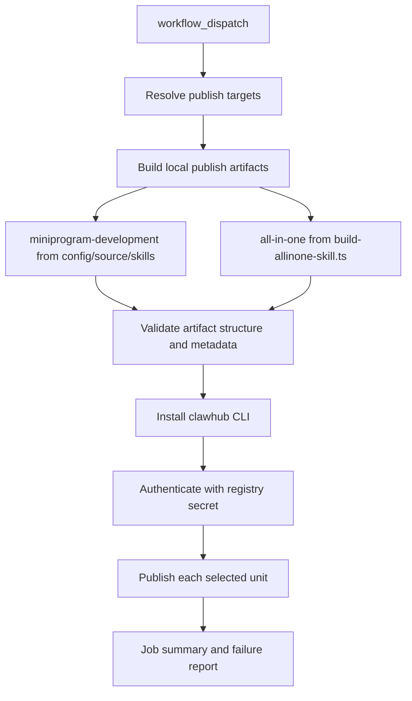

# 技术方案

## 概述

本方案新增一条面向 ClawHub public skill registry 的发布链路，但不改动现有 skills repo 发布链路与 all-in-one 仓库同步链路。

发布模型采用“显式发布单元”而不是“扫描全部 Skill 目录”：

- `miniprogram-development`：直接发布原始 skill 源
- `all-in-one`：复用现有 `scripts/build-allinone-skill.ts` 生成的 `cloudbase` 聚合 Skill 后发布

这样可以满足“按目标发布”的要求，同时避免误把 `config/source/skills/` 下所有 Skill 都发到 ClawHub。

## 架构设计



## 发布单元建模

新增一个集中式发布单元定义脚本，例如 `scripts/clawhub-publish-targets.mjs`，职责如下：

- 维护允许发布的单元白名单
- 描述每个单元的来源类型、构建方式、最终 registry 名称
- 统一做目标解析、输入校验和错误提示

建议数据结构：

```js
{
  "miniprogram-development": {
    type: "local-skill",
    sourceDir: "config/source/skills/miniprogram-development",
    registryName: "miniprogram-development"
  },
  "all-in-one": {
    type: "generated-allinone",
    buildCommand: "node scripts/build-allinone-skill.ts --dir <tmp>",
    outputDir: "<tmp>/cloudbase",
    registryName: "cloudbase"
  }
}
```

设计理由：

- 避免把发布逻辑散落在 workflow shell 中，后续增删单元更可控
- `all-in-one` 与普通 skill 的来源形态不同，需要显式区分
- `setup-cloudbase-openclaw` 已不维护，因此不继续纳入发布单元模型

## 脚本设计

### 1. 新增发布产物准备脚本

新增 `scripts/build-clawhub-publish-artifacts.mjs`，职责：

- 接收目标单元列表，例如 `--targets miniprogram-development,all-in-one`
- 在临时输出目录下为每个目标单元生成独立发布目录
- 为每个发布目录执行结构校验
- 输出一份 machine-readable manifest，供 GitHub Actions 后续步骤消费

建议输出目录：

```text
.clawhub-publish-output/
  manifest.json
  miniprogram-development/
    SKILL.md
    references/...
  all-in-one/
    SKILL.md
    references/...
```

`manifest.json` 建议包含：

- `targetKey`
- `registryName`
- `artifactDir`
- `sourceType`
- `sourceDescription`

### 2. 复用现有构建链路

`miniprogram-development`：

- 直接从 `config/source/skills/miniprogram-development/` 拷贝
- 沿用现有 `build-skills-repo.mjs` 的 frontmatter 校验思路

`all-in-one`：

- 直接调用 `scripts/build-allinone-skill.ts --dir <tempDir>`
- 从 `<tempDir>/cloudbase` 收集产物
- 不复制 all-in-one 聚合逻辑，避免双份实现漂移

### 3. 校验逻辑

`build-clawhub-publish-artifacts.mjs` 需要至少校验：

- 目标单元是否合法
- 产物目录是否存在 `SKILL.md`
- `SKILL.md` 是否含 frontmatter
- frontmatter 中是否至少存在 `name` 与 `description`

这部分校验失败时直接退出非 0，并输出明确单元名称。

## GitHub Actions 设计

新增 workflow：`.github/workflows/publish-clawhub-registry.yml`

触发方式仅建议 `workflow_dispatch`，避免默认 push 自动发布。

建议输入：

- `targets`：逗号分隔，必填，例如 `miniprogram-development,all-in-one`
- `dry_run`：可选，是否只构建与校验，不真正发布
- `bump`：可选，版本升级类型，支持 `patch|minor|major`，默认 `minor`
- `changelog`：可选，发布说明，可为空
- `tags`：可选，逗号分隔标签，默认 `latest`

建议 secrets：

- `CLAWDHUB_TOKEN`：ClawHub 发布凭证

工作流步骤：

1. checkout 当前仓库
2. setup Node.js
3. 执行 `node scripts/build-clawhub-publish-artifacts.mjs`
4. 安装 ClawHub CLI，例如 `npm install -g clawhub`
5. 使用 `clawhub login --token <token> --no-browser` 完成非交互认证
6. 遍历 `manifest.json`，逐个执行 `clawhub sync --root <artifactDir> --all` 命令
7. 生成 Job Summary

如果 `dry_run=true`，则跳过真正的 publish，仅输出将要发布的单元与目录。

## ClawHub CLI 集成

当前仓库内没有 ClawHub CLI 现成集成，因此工作流设计采用“最小耦合”方式：

- CLI 安装只放在 workflow 里，不耦合到常规项目依赖
- publish 命令封装在独立脚本 `scripts/publish-to-clawhub.mjs` 中，避免 workflow shell 过重
- token 通过环境变量注入，不写入仓库文件

已确认本方案采用的 CLI 同步命令格式为：

```bash
clawhub sync \
  --root <artifactDir> \
  --all \
  --bump <patch|minor|major> \
  --changelog <text> \
  --tags <tags>
```

`publish-to-clawhub.mjs` 职责：

- 读取 `manifest.json`
- 根据 `dryRun` 决定是否执行真实发布
- 使用 `child_process.execFileSync` 调用 `clawhub`
- 逐单元记录成功/失败
- 失败时汇总错误并以非 0 退出

脚本需要把 workflow 输入的 `bump`、`changelog`、`tags` 透传到 sync 命令，并让 ClawHub 自己处理版本号递增。

## 测试策略

新增自动化测试，优先覆盖脚本层而不是 workflow 真发布：

1. `tests/build-clawhub-publish-artifacts.test.js`
   - 指定 `miniprogram-development` 时可生成产物
   - 指定 `all-in-one` 时可生成 `cloudbase` 聚合产物
   - 指定非法目标时失败

2. `tests/publish-targets.test.js`
   - 校验发布单元白名单与 registryName 映射
   - 防止未来误把“全量 source skills”加入默认发布范围

3. 保留现有 `tests/build-skills-repo.test.js` 与 `tests/build-allinone-skill.test.js`
   - 作为回归保护，确认新增链路未破坏既有构建能力

## 安全性

- 发布凭证仅通过 GitHub Secrets 注入
- workflow 不在日志中打印 token
- 发布目标采用白名单解析，避免任意路径被当作 Skill 发布

## 风险与处理

风险 1：ClawHub CLI 的实际 publish 参数与当前假设不一致

- 处理：把 CLI 调用集中在 `publish-to-clawhub.mjs` 的命令拼装函数中，降低修改面

风险 2：all-in-one 构建依赖 Node 版本

- 处理：workflow 与测试都沿用现有 Node 22/24 约束，优先复用已存在的 all-in-one 构建方式

风险 3：用户误以为此工作流会自动发布全部 skills

- 处理：workflow 输入与日志都显式使用 `targets` 概念，并对未知目标直接失败
