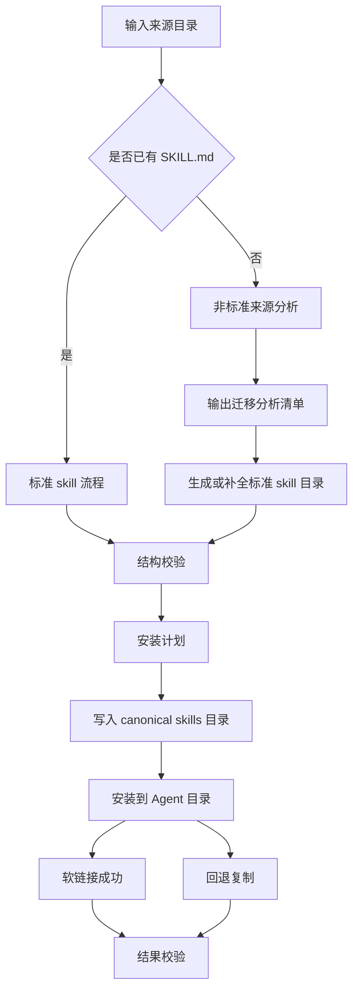

# 技术方案设计

## 概述

本方案为仓库根目录 `skills/` 新增一个项目自维护 skill：`skills/manage-local-skills/`。它的目标不是实现一个完整的 npm CLI，而是提供一套可被 Agent 直接复用的本地 skills 管理资产，包含：

- 主 `SKILL.md`，定义迁移与安装工作流
- `references/`，沉淀对齐 `skills` CLI 的安装模型、非标准目录识别方法、映射扩展方法
- `scripts/`，承接重复且易错的迁移分析、标准 skill 安装、结构校验动作

安装语义以 `skills` CLI 源码行为为基线，重点对齐以下能力：

- canonical skills 目录与 per-agent 目标目录分离
- project scope 与 global scope 两套路径模型
- 优先软链接，失败时回退复制
- 通用 `.agents/skills` 与 Agent 专有 skills 目录的统一抽象
- 路径安全校验、冲突检查与结果验证

## 目标

- 在 `skills/manage-local-skills/` 内提供可对外复用的 community skill 结构
- 支持识别标准 skill 与非标准“类 skill”目录
- 支持把标准 skill 以接近 `skills` CLI 的方式安装到指定 Agent 目录
- 支持通过独立映射表扩展新的 Agent / IDE
- 在需要时提供脚本，减少人工反复操作和安装偏差

## 非目标

- 不在第一版复刻 `skills` CLI 的远程仓库拉取、交互式 TUI、遥测与在线检索
- 不改造当前 `config/source/skills/` 发布链路，也不把该 skill 挪到 `config/source/skills/`
- 不要求第一版覆盖 `skills` CLI 支持的全部 Agent，只要求结构上可扩展，初始映射覆盖本项目高频 Agent
- 不自动“完美重写”所有非标准目录内容；对于语义不完整的来源，允许输出分析计划并要求用户确认

## 现状与约束

### 1. `skills` CLI 已有的安装模型

从 `skills@1.4.5` 的 `dist/cli.mjs` 可见，其安装核心不是“直接把源目录链接到每个 Agent”，而是以下模型：

1. 先解析 source，并拿到标准 skill 源目录
2. 将 skill 内容复制到 canonical skills 目录
   - project scope: `<cwd>/.agents/skills/<skill-name>`
   - global scope: `~/.agents/skills/<skill-name>`
3. 对通用 Agent 直接使用 canonical 目录
4. 对专有 Agent 再把对应 skill 安装到其 agent-specific 目录
   - 优先软链接到 canonical 目录
   - 软链接失败时回退为复制

该模型的优点是：安装结果稳定、源目录不直接暴露给每个 Agent、更新与冲突处理更清晰。本方案直接复用这个抽象。

### 2. 当前仓库约束

- 项目内自维护 skill 放在根目录 `skills/`
- 当前 `scripts/build-skills-repo.mjs` 主要消费 `config/source/skills/`，不消费根目录 `skills/`
- 仓库已有 Node.js 运行时和 `tests/` 目录，适合新增 Node 脚本与测试

因此本方案把该 skill 建模为“项目内 skill + 可复用脚本资源”，而不是当前对外发布链路的直接输入源。

## 总体架构



## 文件结构设计

目标目录结构：

```text
skills/manage-local-skills/
├── SKILL.md
├── references/
│   ├── cli-alignment.md
│   ├── source-classification.md
│   ├── migration-playbook.md
│   ├── install-workflow.md
│   └── mapping-extension.md
└── scripts/
    ├── inspect-source.mjs
    ├── install-skill.mjs
    ├── validate-skill.mjs
    └── lib/
        ├── agent-mappings.mjs
        ├── path-safety.mjs
        └── install-model.mjs
```

各文件职责：

- `SKILL.md`
  - 说明何时使用该 skill
  - 指导 Agent 先分类来源，再决定迁移、安装或仅分析
  - 路由到 references 和 scripts
- `references/cli-alignment.md`
  - 记录从 `skills` CLI 代码提炼出的安装语义
  - 标注第一版与上游 CLI 的一致项和暂不覆盖项
- `references/source-classification.md`
  - 说明标准 skill / 非标准目录 / 混合来源的识别规则
- `references/migration-playbook.md`
  - 定义如何把规则、文档、脚本、模板归入 `SKILL.md`、`references/`、`scripts/`、`assets/`
- `references/install-workflow.md`
  - 说明 project/global、symlink/copy、dry-run 等使用策略
- `references/mapping-extension.md`
  - 说明如何新增编辑器 / Agent 映射
- `scripts/inspect-source.mjs`
  - 对输入来源做结构探测和迁移计划输出
- `scripts/install-skill.mjs`
  - 对标准 skill 执行 canonical 安装与 per-agent 安装
- `scripts/validate-skill.mjs`
  - 校验标准 skill 结构和安装结果
- `scripts/lib/*.mjs`
  - 复用路径安全、Agent 映射、安装路径计算逻辑

## 核心设计

### 1. 来源识别与迁移分析

`inspect-source.mjs` 负责分类输入来源，并输出 machine-readable 分析结果，避免把非标准迁移完全依赖自然语言推断。

建议命令接口：

```bash
node skills/manage-local-skills/scripts/inspect-source.mjs \
  --input <path> \
  [--subpath <relative-subdir>] \
  [--json]
```

输出内容：

- `sourceType`: `standard` | `nonstandard` | `mixed`
- `candidateSkillName`
- `detectedFiles`
- `suggestedReferences`
- `suggestedScripts`
- `warnings`

识别策略：

- 若根目录或指定子目录存在 `SKILL.md`，优先判为标准 skill
- 若存在规则文档、脚本、模板但无 `SKILL.md`，判为非标准来源
- 若一个仓库内同时存在标准 skill 与非标准目录，判为混合来源
- 不执行来源目录中的任意脚本，只做静态分析

这样设计的原因是：安装可以高度确定化，但迁移经常需要 Agent 判断。第一版先把“发现与规划”确定下来，再由 Agent 结合 skill 指令生成最终标准目录，稳定性更高。

### 2. 标准 skill 的规范目录与 canonical 安装目录分离

该 skill 的源码维护目录是：

```text
skills/<skill-name>/
```

但安装时不直接把这个源码目录链接到每个 Agent，而是对齐 `skills` CLI 的 canonical 模型：

- project canonical: `<cwd>/.agents/skills/<skill-name>`
- global canonical: `~/.agents/skills/<skill-name>`

安装流程：

1. 从 `skills/<skill-name>/` 读取标准 skill 源
2. 复制到 canonical 目录
3. 再将 Agent 目标目录链接或复制到 canonical 目录

这样做的好处：

- 源码目录与安装产物解耦
- 更新、覆盖、比较哈希时有稳定安装面
- 多 Agent 安装时无需直接消费源码目录

### 3. 与 `skills` CLI 对齐的安装语义

`install-skill.mjs` 复用 `skills` CLI 的核心抽象，但去掉远程 fetch 与交互式选择。这里的“install”更准确地说是管理本地 skill 到 Agent 目录的挂载过程，能力上包含 symlink/copy 两种落地方式。

建议命令接口：

```bash
node skills/manage-local-skills/scripts/install-skill.mjs \
  --source-dir skills \
  --skill <name> \
  --agent <agent> \
  [--scope project|global] \
  [--mode symlink|copy] \
  [--dry-run]
```

关键行为：

- `--scope project` 时，canonical 路径位于当前项目 `.agents/skills`
- `--scope global` 时，canonical 路径位于用户目录 `~/.agents/skills`
- `--mode symlink` 时，先复制到 canonical，再为目标 Agent 创建软链接
- 软链接失败时自动回退到复制，并报告 `symlinkFailed`
- 若目标 Agent 属于 universal 类型，则其 project 安装直接使用 `.agents/skills`
- 安装前做冲突检查，输出 overwrite / skip / replace 计划
- `--dry-run` 只输出将写入的 canonical 与 target 路径，不实际改动文件

### 4. Agent / IDE 映射模型

映射逻辑放在 `scripts/lib/agent-mappings.mjs`，而不是散落在 `SKILL.md` 示例里。建议数据结构：

```js
{
  universal: {
    skillsDir: '.agents/skills',
    universal: true
  },
  'claude-code': {
    skillsDir: '.claude/skills',
    globalSkillsDir: '~/.claude/skills'
  },
  cursor: {
    skillsDir: '.agents/skills',
    globalSkillsDir: '~/.cursor/skills'
  },
  codex: {
    skillsDir: '.agents/skills',
    globalSkillsDir: '${CODEX_HOME:-~/.codex}/skills'
  }
}
```

第一版建议至少覆盖：

- `universal`
- `claude-code`
- `cursor`
- `codex`

原因：

- 这是当前本项目最容易实际使用到的一组 Agent
- 其中已经同时覆盖通用路径与专有路径两类模型
- 扩展其他 Agent 时只需补充映射，不需重写安装算法

后续扩展时，只需要：

1. 在 `agent-mappings.mjs` 增加一项
2. 在 `references/mapping-extension.md` 补充说明
3. 为新映射增加测试用例

### 5. 路径安全与复制策略

为避免路径穿越与误删目录，`path-safety.mjs` 统一实现：

- skill 名称规范化
- `resolve + normalize` 后的 base/target 安全比较
- 拒绝 `..`、非法绝对路径拼接、危险清理目标

复制策略参考 `skills` CLI：

- 递归复制标准 skill 目录
- 默认忽略 `.git`、`node_modules`、隐藏文件、无关元数据
- Windows 下创建软链接时使用 `junction` 兼容语义

### 6. 校验模型

`validate-skill.mjs` 分两类校验：

1. 结构校验
   - 是否存在 `SKILL.md`
   - frontmatter 是否包含 `name` 和 `description`
   - `name` 是否符合 kebab-case
   - `references/` 引用路径是否存在

2. 安装校验
   - canonical 路径是否已生成
   - Agent 目标路径是否存在
   - 若为软链接，目标是否指向 canonical 目录
   - 若为复制，关键文件是否完整存在

建议命令接口：

```bash
node skills/manage-local-skills/scripts/validate-skill.mjs \
  --skill-dir <path> \
  [--installed-path <path>]
```

## 实现策略

### 主 Skill 的行为设计

`SKILL.md` 采用“先分析、再决定是否执行”的工作方式：

1. 识别用户是要迁移、安装、扩展映射，还是只做分析
2. 若来源不标准，先运行 `inspect-source.mjs`
3. 若已是标准 skill，直接进入校验或安装流程
4. 安装前明确 scope、agent、mode、dry-run 需求
5. 优先使用脚本完成确定性动作，减少手工文件操作

### 与 CLI 的差异管理

为了避免“看起来像对齐，实际行为漂移”，`references/cli-alignment.md` 需要显式列出：

- 已对齐：canonical 目录、scope、symlink fallback、path safety、universal vs specific agent
- 暂不覆盖：远程仓库 clone、交互式 agent 选择、audit/telemetry、lock file

这样用户在需要更强能力时，能明确知道这个 skill 的边界。

## 测试策略

新增测试建议放在 `tests/` 下，覆盖以下场景：

1. `inspect-source.mjs`
   - 标准 skill 目录识别
   - 非标准目录识别
   - 混合来源识别

2. `install-skill.mjs`
   - project scope 的 canonical 路径解析
   - global scope 的 canonical 路径解析
   - universal Agent 与专有 Agent 的目标路径差异
   - `--mode symlink` 成功路径
   - `--mode copy` 显式复制路径
   - 已存在同名 skill 时的冲突结果

3. `validate-skill.mjs`
   - frontmatter 缺失时报错
   - 引用文件缺失时报错
   - 软链接目标错误时报错

测试方式采用 Node + 临时目录，不依赖真实用户环境中的 Agent 安装状态。

## 安全性与维护性

- 不执行来源目录中的外部脚本，迁移分析只做静态读取
- 所有安装写入都限制在 canonical 目录和映射出的目标目录内
- 通过 `--dry-run` 支持“先看计划、再执行”
- Agent 映射集中维护，降低新增编辑器时的改动面
- skill 源码在 `skills/` 下独立维护，不耦合当前对外发布链路

## 风险与缓解

风险：

- 用户期待完整复刻 `npx skills add` 的远程安装能力
- 非标准目录迁移的语义差异过大，难以一次性自动完成
- 各 Agent 目录规则持续变化，映射可能过时

缓解方式：

- 在 `cli-alignment.md` 中明确第一版对齐范围与差异项
- 对迁移场景优先提供分析清单和半自动工作流，而不是承诺全自动改写
- 将路径映射收敛到单一模块，并用测试守护常见 Agent 行为
