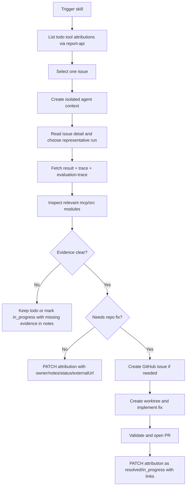

# 技术方案设计

## 背景

本次规划目标是新增一个对外 skill，用于指导 Agent 自动处理评测系统中的 MCP attribution issues。该 skill 需要围绕 `report-api` 完成 issue 拉取、run 证据排查、`mcp/src` 代码价值判断、issue 状态更新，以及在问题值得修复时通过独立 worktree 完成修复、提交 GitHub issue / PR 的闭环。

用户已明确本次可以跳过 `requirements.md`，因此本设计直接以用户输入作为需求基线进入规划阶段。

## 目标与约束

### 目标 1 - 自动处理待跟进的 tool 类 attribution issues

- 仅聚焦 `category=tool` 的 attribution issues。
- 默认从 `GET /api/attributions?category=tool&resolutionStatus=todo&limit=50` 开始。
- 对 issue 逐个形成可审计结论，而不是只做概览。

### 目标 2 - 证据驱动更新 attribution issue

- 更新 issue 前，至少读取一个关联 run 的 `result` 和 `trace`，并优先补充 `evaluation-trace`。
- `owner` 固定写 `"codex"`。
- `notes` 必须记录结论依据、关键 run、关键检查项、工具/代码信号。
- 只有证据充分时才允许更新 `resolutionStatus`。

### 目标 3 - 结合 `mcp/src` 判断问题是否有价值

- 不是所有 tool issue 都需要修复。
- 需要根据 issue 对应的工具、trace 中的真实调用链、以及 `mcp/src/tools/*.ts` 的当前实现判断问题是：
  - MCP 工具真实缺陷
  - 工具返回结构与评测预期不匹配
  - 环境问题 / 误报 / 非 MCP 代码问题
  - 已有 issue / 已有修复的重复归因

### 目标 4 - 每个 issue 独立 Agent / 独立上下文

- 每个 issue 必须单独排查，避免上下文污染。
- 如果运行环境支持多 Agent，则一个 issue 对应一个 Agent。
- 如果需要改代码，则一个 issue 对应一个 worktree 与独立分支。

### 目标 5 - 支持 GitHub issue / PR 闭环

- 如果已经存在对应 GitHub issue，则将链接写入 `externalUrl`。
- 如果问题明确且尚无 issue，可使用 `gh` 提交到 `TencentCloudBase/CloudBase-MCP`。
- 如果具备明确修复路径，可在 worktree 中修复并提交 PR。

### 目标 6 - 只通过 `report-api` 更新 attribution

- attribution 的读取与更新只能通过 `report-api`。
- 不允许直接修改数据库或其它旁路状态。
- GitHub issue / PR 是外部闭环，不替代 attribution 更新。

## 方案概览

## Skill 落地结构

建议新增目录：

- `skills/mcp-attribution-worktree/SKILL.md`
- `skills/mcp-attribution-worktree/references/report-api-workflow.md`
- `skills/mcp-attribution-worktree/references/value-triage.md`
- `skills/mcp-attribution-worktree/references/worktree-repair.md`

设计理由：

- `SKILL.md` 负责触发面、主流程、强约束、状态判定规则。
- `report-api-workflow.md` 负责接口顺序、run 选择、PATCH 字段规则。
- `value-triage.md` 负责 issue 是否有价值、如何映射 `mcp/src` 代码面、如何区分误报。
- `worktree-repair.md` 负责 worktree、GitHub issue、修复分支与 PR 流程。

如果后续发现 notes 模板或 GitHub issue 模板重复度高，再考虑补充 `assets/`，本轮可以先不引入脚本。

该目录定位为仓库内置的维护型 skill，而不是对外发布的 CloudBase product skill，因此不进入 `config/source/skills/`，也不参与对外 prompts 和兼容产物生成。

## 核心设计

### 1. Skill 触发边界

skill 的 `description` 需要覆盖以下触发面：

- 用户要求处理评测 attribution issues
- 用户要求基于 `report-api` 自动更新归因 issue
- 用户要求排查 MCP tool 类问题并决定是否修复
- 用户要求基于 worktree 隔离修复归因问题

同时明确非适用场景：

- 普通 bug 修复但没有 attribution / run 证据
- 非 `tool` 类 issue
- 不涉及 `report-api` 的一般性代码分析

### 2. Attribution 拉取与筛选

skill 主流程第一步固定执行：

1. `GET /api/attributions?category=tool&resolutionStatus=todo&limit=50`
2. 逐个 `GET /api/attributions/:issueId`
3. 按以下优先级选择代表性 run：
   - 最近一次失败
   - 分数最低
   - runCount 较高且标题稳定
4. 仅当 issue 与 `mcp/src` 代码或工具设计明显相关时，进入深挖

建议在 `value-triage.md` 中固化“高价值问题”标准：

- 低分且影响核心能力链路
- 多次复现
- 工具返回缺字段 / 参数设计错误 / 能力缺失 / 引导缺失
- 能明确定位到 `mcp/src` 模块或工具注册逻辑

低价值或不应修复的问题包括：

- 浏览器未安装、环境池异常、第三方依赖故障
- 评测脚本自身 schema 偏差但 MCP 实际结果完整
- 已有外部 issue / 已合并修复且仅状态未同步

### 3. 单 issue 隔离执行模型

skill 需要强制以下规则：

1. issue 之间不共享分析上下文。
2. 支持多 Agent 时，一个 issue 分配一个 Agent。
3. 进入代码修复前，为该 issue 创建专属 worktree。
4. worktree 命名包含 `issueId` 或问题 slug，例如：
   - `../wt-attribution-issue_mn1aftau_jkqg0y`
   - 分支名 `feature/attribution-issue-mn1aftau`

如果外部环境不支持多 Agent，skill 仍需要求串行处理，但每次只保留当前 issue 的上下文和 worktree。

### 4. 证据采集与结论规则

每个 issue 必须最少采集以下证据：

1. issue detail
2. 至少一个 run 的 `result`
3. 至少一个 run 的 `trace`
4. 优先补充该 run 的 `evaluation-trace`
5. 与该 run 对应的 `mcp/src` 实现位置

状态判定写入 skill：

- `todo`
  - 尚未接手
  - 证据不足
  - 还未读完最小证据集
- `in_progress`
  - 已确认问题真实存在，正在修复或已明确方向
  - 或仍缺少外部验证，但已形成稳定判断
- `resolved`
  - 已有明确修复、已有 GitHub issue / PR、或问题已闭环
- `invalid`
  - 误报、环境问题、非 MCP 代码问题、重复 issue

`notes` 模板建议统一为单行审计格式，便于后续检索：

`run=<caseId>/<runId>; result=<status>; score=<score>; failed_check=<name>; tool_signal=<tool or module>; code_signal=<file>; conclusion=
`

### 5. `mcp/src` 价值判断映射

`value-triage.md` 需要提供归因到代码的快速映射，至少覆盖当前高频模块：

| 问题类型 | 优先检查代码 | 判断重点 |
| --- | --- | --- |
| 环境信息 / hosting / package 字段缺失 | `mcp/src/tools/env.ts`, `mcp/src/tools/hosting.ts` | 返回字段是否缺失、是否被上层裁剪 |
| NoSQL 创建/写入/查询 | `mcp/src/tools/databaseNoSQL.ts`, `mcp/src/tools/dataModel.ts` | 工具能力是否缺失、返回结构是否过深 |
| 云函数部署 / HTTP 类型 / 网关访问 | `mcp/src/tools/functions.ts`, `mcp/src/tools/gateway.ts` | 参数 schema、默认值、错误引导、链路提示 |
| 环境创建/销毁/套餐 | `mcp/src/tools/env.ts`, `mcp/src/tools/capi.ts`, `mcp/src/tools/setup.ts` | 是否缺少专门工具、是否只暴露底层动作且缺少引导 |
| 鉴权 / 设备码流程 | `mcp/src/tools/interactive.ts`, `mcp/src/tools/env.ts` | 是否为自动化场景不适配，而非工具 defect |
| 下载 / IDE 配置 / 安装引导 | `mcp/src/tools/setup.ts`, `mcp/src/tools/download.ts` | 文件映射、说明缺失、兼容面回退 |

该映射的目的是让 Agent 在更新 issue 前，先判断这是“代码要改”还是“评测/环境要解释”。

### 6. GitHub issue / worktree 修复闭环

当问题满足以下条件时，进入修复闭环：

- 已有明确证据
- 可以定位到具体文件或工具设计
- 不是单纯环境误报

具体策略：

1. 先查是否已有 GitHub issue
2. 若已有 issue，则记录到 `externalUrl`
3. 若没有 issue 且问题明确，则使用 `gh` 创建 issue
4. 若准备修复，则：
   - 创建独立 worktree
   - 在 worktree 中修改代码
   - 验证相关测试或最小复现
   - 推送分支并创建 PR
5. attribution 更新规则：
   - 只有已有 issue / PR / fix 证据时，才写 `resolved`
   - 仅定位到问题但尚未闭环时，用 `in_progress`

## 仓库落地边界

该 skill 属于维护仓库自身质量和评测闭环的内部能力，落地时遵循以下边界：

- 源码放在根目录 `skills/` 下，与 `skill-authoring`、`manage-local-skills` 同级。
- 不放入 `config/source/skills/`，避免被误认为对外 CloudBase 使用 skill。
- 不更新 `doc/prompts/config.yaml`。
- 不要求生成 `.generated/compat-config/`、`.skills-repo-output/`、`config/.claude/skills/` 等对外兼容产物。

## 接口与实现风险

### 风险 1 - OpenAPI 与真实 PATCH 能力存在偏差

当前 `openapi.json` 中 `AttributionPatchRequest` 只展示了旧字段，但实际列表 / 详情返回已经包含 `owner`、`notes`、`externalUrl`。skill 应要求先用实际接口行为为准，不盲信 schema。

### 风险 2 - 多 Agent 能力并非所有运行环境都支持

skill 应写成“优先使用多 Agent，一 issue 一 agent；否则串行但保持单 issue 独立上下文”，避免把能力假设写死。

### 风险 3 - worktree 是修复机制，不是排查前置条件

对无需改代码的 issue，不应该提前创建 worktree，否则批量处理成本过高。skill 应要求“先证据、后 worktree”。

## 验证策略

本 skill 落地后，建议验证以下内容：

1. 内容验证
   - `SKILL.md` frontmatter 是否清晰描述触发面
   - 主文档是否明确写出最小证据集与状态更新约束
   - references 是否实现按需读取，而非把全部细节堆进主文档

2. 仓库集成验证
   - 确认新 skill 可被仓库内 agent 发现和读取
   - 确认 references 路径均相对于 `skills/mcp-attribution-worktree/` 成立

3. 最小回归验证
   - 检查 skill 文档结构与现有根目录内置 skill 风格一致
   - 如后续为该 skill 增加脚本或模板，再补针对性的本地验证

## 产出物

本次实现阶段建议至少包含：

- `skills/mcp-attribution-worktree/` 目录与主 `SKILL.md`
- 3 个 references 文档

如果实现阶段发现该 skill 需要示例模板，可追加：

- `assets/note-template.md`
- `assets/github-issue-template.md`
