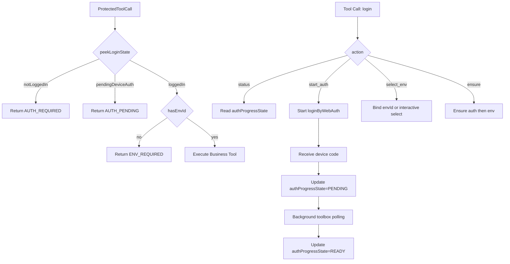

# 技术方案设计

## 概述

本方案在现有 MCP 架构上增加 Device Flow 兼容层，并收敛所有受保护工具的认证行为。核心目标是：

1. `login` 工具支持统一多动作（`ensure/start_auth/select_env/status`）；
2. 设备码信息通过 `auth_challenge` 和结构化结果稳定下发；
3. 其他受保护工具在未登录、授权进行中或未选环境时快速失败，并显式引导调用 `login` 工具；
4. 不改变现有环境选择核心流程，仅拆分“读状态”和“保证状态”的职责。

方案以最小改造为原则，主要涉及 `mcp/src/auth.ts`、`mcp/src/tools/env.ts`、`mcp/src/tools/interactive.ts` 和依赖版本更新。

## 架构设计



## 关键设计点

### 1) 认证层统一入口增强（`auth.ts`）

- 新增类型：
  - `AuthFlowMode = "web" | "device"`
  - `DeviceFlowAuthInfo`（包含 `user_code`、`verification_uri`、`device_code`、`expires_in`）
- 新增两类能力：
  - `peekLoginState()`：纯读取登录态，不触发认证
  - `ensureLogin()`：显式触发 `loginByWebAuth()`，仅供 `login` tool 和明确交互入口调用
- 新增 `authProgressState` 注册表：
  - `status: IDLE | PENDING | READY | DENIED | EXPIRED | ERROR`
  - `authChallenge`
  - `lastError`
- 模式优先级：
  1. `options.authMode`
  2. `process.env.TCB_AUTH_MODE`
  3. 默认 `device`
- `device` 模式在 `onDeviceCode` 时立即写入 `PENDING`，后台登录完成后更新为 `READY` 或错误态。

### 2) login tool 多动作模型（`env.ts`）

- 输入模型新增：
  - `action`: `ensure | start_auth | select_env | status`（默认 `ensure`）
  - `authMode`: `device | web`
  - `envId`（`select_env` 时使用）
- 行为定义：
  - `start_auth`：只认证。`device` 模式在拿到设备码后立即返回 `AUTH_PENDING`，后台继续轮询并写入本地 credential
  - `select_env`：只做环境选择或绑定，复用旧流程
  - `ensure`：确保登录与环境就绪（默认）
  - `status`：只读返回当前状态，不执行副作用

### 3) Device Flow 结果可见性

- 主通道：`login(action=start_auth, authMode=device)` 直接返回结构化 `auth_challenge`
- 状态通道：`login(action=status)` 和其他受保护工具可读取 `authProgressState`，在授权进行中持续返回 `AUTH_PENDING`
- 兜底通道：`hint` 文本仍可保留可读提示，但协议以 JSON 字段为准

### 4) 交互层继续复用现有环境选择流程（`interactive.ts`）

- `_promptAndSetEnvironmentId()` 的 `options` 扩展支持：
  - `authMode`
  - `onDeviceCode`
- 在内部调用 `ensureLogin()` 时透传上述参数，确保 `login(action=ensure)` 与旧交互流程一致。

### 5) 统一错误响应模型（面向用户和 Agent）

`login` 工具在成功、失败、待处理场景统一返回结构化结果，便于 Agent 自动恢复：

```json
{
  "ok": false,
  "code": "ENV_REQUIRED",
  "message": "当前已登录，但尚未绑定环境，请先调用 login 工具选择环境。",
  "auth_challenge": {
    "user_code": "WDJB-MJHT",
    "verification_uri": "https://xxx/device",
    "expires_in": 600
  },
  "env_candidates": [
    { "envId": "env-1", "alias": "prod", "region": "ap-shanghai" }
  ],
  "next_step": {
    "tool": "login",
    "action": "select_env",
    "required_params": ["envId"],
    "suggested_args": { "action": "select_env", "envId": "env-1" }
  }
}
```

#### 错误码与恢复策略

| code | 含义 | 用户指引 | Agent next_step |
| --- | --- | --- | --- |
| `AUTH_REQUIRED` | 未登录 | 先完成登录 | `login.start_auth` |
| `AUTH_PENDING` | 设备码待确认 | 打开链接输入用户码 | `login.status` |
| `AUTH_DENIED` | 用户拒绝授权 | 重新发起授权 | `start_auth` |
| `AUTH_EXPIRED` | 设备码过期 | 重新获取设备码 | `start_auth` |
| `ENV_REQUIRED` | 已登录但未选环境 | 从候选环境中选择 | `login.select_env(envId)` |
| `NO_ENV` | 无可用环境 | 创建环境或手动设置 | `select_env` 或创建环境流程 |
| `INVALID_ARGS` | 参数不完整/无效 | 按提示补齐参数 | 按 `required_params` 重试 |
| `INTERNAL_ERROR` | 未分类内部错误 | 稍后重试/联系管理员 | 重试 `status` 或 `ensure` |

### 6) 受保护工具统一 fail-fast（`cloudbase-manager.ts`）

- `getCloudBaseManager()` 默认使用 `authStrategy = "fail_fast"`
- 在 `fail_fast` 模式下：
  - 未登录：抛出结构化 `AUTH_REQUIRED`
  - 设备码授权进行中：抛出结构化 `AUTH_PENDING`
  - 已登录但缺少环境：抛出结构化 `ENV_REQUIRED`
- 仅 `login(action=ensure)` 和 `_promptAndSetEnvironmentId()` 使用显式 `ensure` 流程继续复用旧交互链路
- 显式传入 `cloudBaseOptions` 视为“调用方自行提供凭证/环境”的旁路模式；若要求环境但未提供 `envId`，同样返回 `ENV_REQUIRED`

## 依赖与版本

- `@cloudbase/toolbox` 升级到 `0.7.17-beta.1`（需包含 `mode=device`、`onDeviceCode` 能力）。

## 兼容性与风险

### 兼容性

- `action=ensure` 作为默认语义，兼容原“完整登录”行为；
- 环境选择状态机和错误处理沿用现有逻辑；
- 未触发 Device Flow 时不会新增额外交互负担。

### 风险

- toolbox 为 beta 版本，可能存在接口细节变更；
- 部分客户端可能不支持 logging notice，已通过 `content` 辅通道兜底。

## 测试策略

1. `login(action=start_auth, authMode=device)`：
   - 验证返回 `AUTH_PENDING` 与 `auth_challenge`
   - 验证后台登录完成后 `status` 可观察到状态变化
2. `login(action=ensure)`：
   - 验证兼容原流程，最终可返回环境 ID。
3. `login(action=select_env)`：
   - 验证跳过认证分支，仅环境选择正常。
4. `login(action=status)`：
   - 验证只读返回状态，不触发认证和环境选择副作用。
   - 验证 `PENDING` 状态下可返回 `auth_challenge`
5. 回归：
   - 其他受保护工具在未登录时快速失败并返回 `next_step.tool=login`
   - `envQuery`、自动环境设置、switch account 路径行为不回退。

