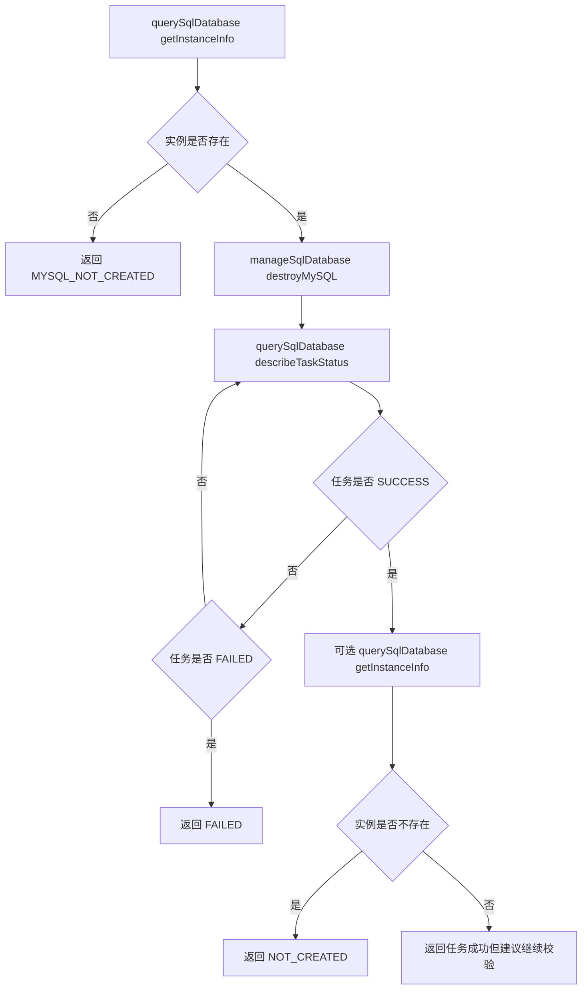

# 技术方案设计

## 架构概述

本次在现有 SQL 双工具模型上补齐 MySQL 销毁生命周期，不新增第三个工具，继续保持：

1. `querySqlDatabase`：查询类动作
2. `manageSqlDatabase`：管理类动作

设计原则是严格贴合 CloudBase SQL 官方 API，而不是自定义抽象参数：

- `DestroyMySQL`：发起销毁
- `DescribeMySQLTaskStatus`：查询销毁任务状态
- `DescribeCreateMySQLResult`：确认环境当前是否仍存在 MySQL
- `DescribeMySQLClusterDetail`：在 `DescribeCreateMySQLResult` 显示已开通时，补充集群详情与状态

## API 对齐策略

### 1. `DestroyMySQL`

来源：[DestroyMySQL](https://cloud.tencent.com/document/api/876/128182)

接口约束：

- 输入仅要求 `EnvId`
- 输出 `Data.IsSuccess`、`Data.TaskId`、`Data.TaskName`

工具设计约束：

- `manageSqlDatabase(action="destroyMySQL")` 继续使用 `request?: Record<string, unknown>` 承载官方原始参数
- 实际调用时只透传文档允许的字段，并始终补 `EnvId`
- 返回值中保留 `task.request.TaskId` / `task.request.TaskName`，供后续 `describeTaskStatus` 直接复用

### 2. `DescribeMySQLTaskStatus`

来源：[DescribeMySQLTaskStatus](https://cloud.tencent.com/document/api/876/128183)

接口约束：

- 输入：`EnvId`，可选 `TaskId`、`TaskName`
- 输出：`Data.Status`、`Data.StatusDesc`

工具设计约束：

- 销毁流程中的状态轮询不新增专用 action，继续复用 `querySqlDatabase(action="describeTaskStatus")`
- 销毁结果查询以 `DescribeMySQLTaskStatus` 作为主接口
- 统一从 `Response.Data.Status` 读取任务状态
- `SUCCESS` 视为销毁任务成功完成
- `FAILED` / 含错误关键词的状态视为失败，并直接返回结构化错误结果
- 未完成状态映射为 `PENDING` 或 `RUNNING`

### 3. `DescribeCreateMySQLResult`

来源：[DescribeCreateMySQLResult](https://cloud.tencent.com/document/api/876/128185)

接口约束：

- 输入：`EnvId`，可选 `TaskId`
- 输出：`Data.Status`，文档明确包含：
  - `notexist`
  - `init`
  - `doing`
  - `success`
  - `fail`

工具设计约束：

- 在销毁完成确认阶段，若返回 `notexist`，直接视为实例已不存在
- 若返回 `success`，说明当前环境仍存在 MySQL，不能判定为销毁完成
- 若返回 `fail`，视为失败
- 若返回 `init` / `doing`，视为仍在异步过程中

### 4. `DescribeMySQLClusterDetail`

来源：[DescribeMySQLClusterDetail](https://cloud.tencent.com/document/api/876/128184)

接口约束：

- 输入仅要求 `EnvId`
- 输出位于 `Response.Data`
- 集群 ID 为 `Data.DbClusterId`
- 集群状态位于 `Data.DbInfo.ClusterStatus` / `Data.DbInfo.Status`

工具设计约束：

- 仅当 `DescribeCreateMySQLResult` 判断当前环境仍存在 MySQL 时才调用
- `Data.DbInfo.ClusterStatus` / `Status` 用于补充当前实例可用性与状态展示
- 不将 `DbClusterId` 误作 `RunSql` 所需的 `DbInstance.InstanceId`

## 工具设计

### 1. `manageSqlDatabase`

新增 action：

```ts
type ManageSqlDatabaseInput =
  | {
      action: "destroyMySQL";
      confirm: true;
      request?: Record<string, unknown>;
    }
  | ...
```

处理流程：

1. 通过 `getInstanceInfo` 判断当前环境是否存在实例
2. 若实例不存在，直接返回结构化阻断结果
3. 若实例存在但未就绪，也允许发起销毁，因为销毁属于资源管理动作
4. 调用 `DestroyMySQL`
5. 从返回结果中提取 `TaskId` / `TaskName`
6. 返回统一包络和下一步建议

返回结构：

```json
{
  "success": true,
  "data": {
    "status": "RUNNING",
    "task": {
      "request": {
        "TaskId": "16710",
        "TaskName": "DeleteDataHub"
      },
      "requestId": "..."
    },
    "destroyResult": {
      "IsSuccess": true,
      "TaskId": "16710",
      "TaskName": "DeleteDataHub"
    }
  },
  "message": "MySQL destroy request submitted successfully.",
  "nextActions": [
    {
      "tool": "querySqlDatabase",
      "action": "describeTaskStatus"
    }
  ]
}
```

### 2. `querySqlDatabase`

本次不新增新的 query action，而是扩展现有两类查询的使用方式：

- `describeTaskStatus`
  - 继续承载销毁任务状态与销毁结果查询
- `getInstanceInfo`
  - 在需要时补充确认环境是否已回到“实例不存在”状态

必要时允许 `describeCreateResult` 直接用于实例存在性校验，但对外推荐的主流程是：

1. `describeTaskStatus`
2. `getInstanceInfo`（可选，用于额外确认）

## 生命周期设计



设计原则：

- 销毁提交与状态查询解耦，不在工具内部无限轮询
- 销毁任务结果以 `DescribeMySQLTaskStatus` 为主判断来源
- `getInstanceInfo` 作为补充校验，而不是替代任务状态接口
- 若任务状态返回 `FAILED`，直接给出结构化失败结果，不做内部重试
- 若任务状态成功但实例仍存在，返回结构化结果提示继续校验，而不是静默视为已销毁

## 状态映射设计

### 销毁任务状态

基于 `DescribeMySQLTaskStatus`：

- `SUCCESS` -> `READY`
  说明销毁任务本身执行成功
- `FAILED` / `ERROR` / `ABNORMAL` / `EXCEPTION` -> `FAILED`
  说明销毁任务失败，应通过错误结果暴露给上层
- `INIT` / `DOING` / `PENDING` -> `PENDING`
- `RUNNING` / `PROCESSING` -> `RUNNING`

### 销毁完成确认

基于 `DescribeCreateMySQLResult`：

- `notexist` -> `NOT_CREATED`
- `success` -> `READY`
- `fail` -> `FAILED`
- `init` / `doing` -> `PENDING`

说明：

- 这里的 `READY` 不是“可继续使用”，而是“CreateResult 显示环境仍有已开通实例”
- 对外文案必须区分“任务成功”和“实例已不存在”两个层次
- 销毁流程中优先以任务状态接口表达“成功 / 失败 / 处理中”，实例查询仅作补充确认

## 统一返回与安全性

### 阻断策略

- `destroyMySQL` 缺少 `confirm: true` 时直接阻断
- 实例不存在时不调用 `DestroyMySQL`
- 销毁完成前，后续依赖实例存在的动作仍应通过 `getInstanceInfo` 判断实际状态

### nextActions 设计

- `destroyMySQL` 成功提交后：
  - 推荐 `querySqlDatabase(action="describeTaskStatus")`
- `describeTaskStatus` 返回成功后：
  - 可推荐 `querySqlDatabase(action="getInstanceInfo")`
- `getInstanceInfo` 确认不存在后：
  - 推荐 `manageSqlDatabase(action="provisionMySQL")` 作为后续可选动作

## skill 更新范围

更新：

- `config/source/skills/relational-database-tool/SKILL.md`

新增说明：

1. 销毁 MySQL 只能通过 `manageSqlDatabase(action="destroyMySQL")`
2. 必须显式确认后才能执行
3. 推荐顺序：
   - `querySqlDatabase(action="getInstanceInfo")`
   - `manageSqlDatabase(action="destroyMySQL")`
   - `querySqlDatabase(action="describeTaskStatus")`
   - `querySqlDatabase(action="getInstanceInfo")`

## 测试策略

### 单元测试

- `destroyMySQL` 未确认时阻断
- 实例不存在时不调用 `DestroyMySQL`
- `DestroyMySQL` 请求必须带 `EnvId`
- `DestroyMySQL` 结果中的 `TaskId` / `TaskName` 必须进入后续建议参数
- `describeTaskStatus` 在销毁场景下正确处理 `SUCCESS` / `FAILED`
- `getInstanceInfo` 在销毁完成后正确返回 `NOT_CREATED`

### 回归测试

- 不影响已有 `provisionMySQL` / `runStatement` / `initializeSchema`
- 不影响已有 `DescribeCreateMySQLResult` / `DescribeMySQLClusterDetail` 解析逻辑
