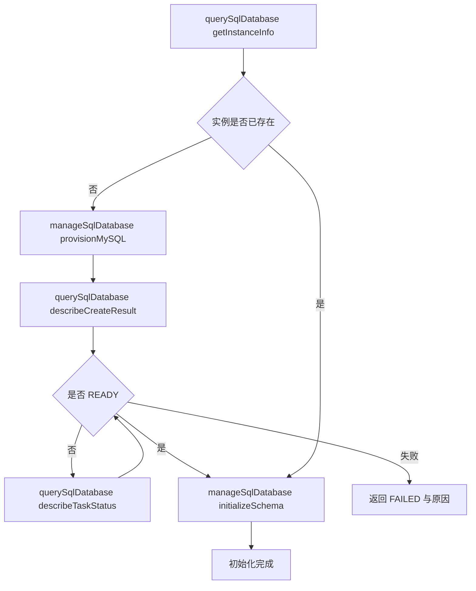

# 技术方案设计

## 架构概述

本次采用最佳设计而不是兼容性改良设计：直接废弃 `executeReadOnlySQL` / `executeWriteSQL` 这组历史命名，改为标准的 SQL 域双工具模型：

1. `querySqlDatabase`：SQL 域唯一只读入口
2. `manageSqlDatabase`：SQL 域唯一管理入口

这样可以把 SQL 查询、MySQL 开通状态查询、实例生命周期管理、DDL 初始化全部收敛到统一的 query/manage 语义中，避免继续把“实例开通”这种控制面动作塞进 `executeWriteSQL` 这类明显不匹配的名字下。

本次设计不保留旧工具别名，不为旧命名做兼容包装；同时仅要求更新 `config/source/skills/relational-database-tool/SKILL.md`，让 source skill 学到新工具和新流程。

## 工具设计

### 1. `querySqlDatabase`

定位：SQL 域只读工具。

#### action 设计

- `runQuery`：执行只读 SQL 查询
- `describeCreateResult`：查询 `DescribeCreateMySQLResult`
- `describeTaskStatus`：查询 `DescribeMySQLTaskStatus`
- `getInstanceInfo`：查询当前环境 SQL 实例上下文，供开通前判断与初始化前校验使用

#### 输入设计

```ts
type QuerySqlDatabaseInput =
  | {
      action: "runQuery";
      sql: string;
      dbInstance?: {
        instanceId?: string;
        schema?: string;
      };
    }
  | {
      action: "describeCreateResult";
      request: Record<string, unknown>;
    }
  | {
      action: "describeTaskStatus";
      request: Record<string, unknown>;
    }
  | {
      action: "getInstanceInfo";
    };
```

设计约束：

- `runQuery` 仅允许只读 SQL
- `describeCreateResult` / `describeTaskStatus` 的 `request` 字段与官方 API 参数保持同构
- `getInstanceInfo` 不依赖外部传参，直接基于当前环境解析数据库实例上下文

#### 返回设计

统一返回结构：

```json
{
  "success": true,
  "data": {},
  "message": "...",
  "nextActions": []
}
```

其中：

- `runQuery` 返回 `data.rows`、`data.columns`、`data.rowsAffected`、`data.requestId`
- `describeCreateResult` 返回 `data.status`、`data.rawStatus`、`data.instance`、`data.task`
- `describeTaskStatus` 返回 `data.status`、`data.rawStatus`、`data.progress`、`data.task`
- `getInstanceInfo` 返回 `data.exists`、`data.instanceId`、`data.schema`、`data.envId`

生命周期状态统一映射为：

- `NOT_CREATED`
- `PENDING`
- `RUNNING`
- `READY`
- `FAILED`

### 2. `manageSqlDatabase`

定位：SQL 域唯一管理工具。

#### action 设计

- `provisionMySQL`：调用 `CreateMySQL` 开通实例
- `runStatement`：执行写 SQL 或单条 DDL
- `initializeSchema`：批量执行建表、建索引等初始化语句

#### 输入设计

```ts
type ManageSqlDatabaseInput =
  | {
      action: "provisionMySQL";
      confirm: true;
      request?: Record<string, unknown>;
    }
  | {
      action: "runStatement";
      sql: string;
      dbInstance?: {
        instanceId?: string;
        schema?: string;
      };
    }
  | {
      action: "initializeSchema";
      statements: string[];
      requireReady?: boolean;
      statusContext?: {
        createResultRequest?: Record<string, unknown>;
        taskStatusRequest?: Record<string, unknown>;
      };
      dbInstance?: {
        instanceId?: string;
        schema?: string;
      };
    };
```

设计约束：

- `provisionMySQL` 强制要求 `confirm: true`
- `runStatement` 承载所有写 SQL / DDL，不再保留独立 execute 工具
- `initializeSchema` 用于表达“实例就绪后的批量初始化”这一高阶动作，而不是让 agent 自己在外面拼多次 DDL

#### 返回设计

- `provisionMySQL` 返回 `data.status`、`data.task`、`data.instance`
- `runStatement` 返回 `data.rowsAffected`、`data.requestId`、`data.statementType`
- `initializeSchema` 返回 `data.executedStatements`、`data.failedStatements`、`data.requestIdList`

## 生命周期设计



设计原则：

- 长流程拆成可重试的小步骤
- 查询动作全部放入 `querySqlDatabase`
- 副作用动作全部放入 `manageSqlDatabase`
- agent 通过 `nextActions` 串联，而不是依赖 tool 内部无限轮询

## CloudBase API 映射

统一通过 `cloudbase.commonService("tcb", "2018-06-08").call()` 调用：

| MCP action | TCB Action | 说明 |
| --- | --- | --- |
| `querySqlDatabase.runQuery` | `RunSql` | 执行只读 SQL |
| `querySqlDatabase.describeCreateResult` | `DescribeCreateMySQLResult` | 查询开通结果 |
| `querySqlDatabase.describeTaskStatus` | `DescribeMySQLTaskStatus` | 查询任务状态 |
| `manageSqlDatabase.provisionMySQL` | `CreateMySQL` | 提交 MySQL 开通 |
| `manageSqlDatabase.runStatement` | `RunSql` | 执行写 SQL / DDL |
| `manageSqlDatabase.initializeSchema` | `RunSql` | 逐条执行初始化 DDL |

`querySqlDatabase.getInstanceInfo` 优先基于 `env.getEnvInfo()` 提取当前环境数据库信息；若信息不足，再结合控制面调用补充判断。

## 返回包络与安全性

### 统一返回包络

```json
{
  "success": true,
  "data": {},
  "message": "Human/AI readable summary",
  "nextActions": [
    {
      "tool": "querySqlDatabase",
      "action": "describeTaskStatus",
      "reason": "MySQL provisioning is still running"
    }
  ]
}
```

### 安全策略

- `runQuery` 结果按不可信数据处理
- `provisionMySQL` 必须显式确认
- `initializeSchema` 默认逐条执行并记录逐条结果
- `runStatement` 对危险语句不额外拦截，但通过工具定位和文档提示明确其副作用

### 阻断策略

- `initializeSchema` 在实例未就绪时直接返回结构化阻断结果
- `provisionMySQL` 在检测到已有实例时返回幂等结果，不重复提交开通
- `runStatement` 若命中“实例未开通/未就绪”错误，返回带 `nextActions` 的结果，引导先查状态

## 命名与职责结论

这是本次最重要的设计决策：

- `executeReadOnlySQL` / `executeWriteSQL` 不是可继续演进的名字
- 最佳设计不是在旧工具上继续加 `action`
- 最佳设计是直接用资源域语言命名：`querySqlDatabase` / `manageSqlDatabase`

原因：

1. SQL 执行只是 SQL 域中的一种动作，不等于整个 SQL 域
2. MySQL 开通是控制面资源管理，不是“执行写 SQL”
3. agent 更容易通过工具名做正确路由，不会把“开通实例”和“执行 DDL”混成一类

## source skill 更新范围

本次仅要求更新 source skill：

- `config/source/skills/relational-database-tool/SKILL.md`

更新内容：

- 将工具说明从 `executeReadOnlySQL` / `executeWriteSQL` 改为 `querySqlDatabase` / `manageSqlDatabase`
- 补充推荐调用顺序：
  1. `querySqlDatabase(action="getInstanceInfo")`
  2. `manageSqlDatabase(action="provisionMySQL")`
  3. `querySqlDatabase(action="describeCreateResult" | "describeTaskStatus")`
  4. `manageSqlDatabase(action="initializeSchema")`
- 明确“读取数据”和“管理实例/执行 DDL”的边界

本次设计不把以下内容作为前置要求：

- 不要求保留旧工具别名
- 不要求在设计阶段同步讨论 `.generated/compat-config/`
- 不要求手改兼容镜像目录

## 实现拆分建议

建议将 `mcp/src/tools/databaseSQL.ts` 重构为可维护结构：

- `resolveSqlDbContext()`：解析 `envId`、`instanceId`、`schema`
- `callSqlControlPlane()`：统一控制面调用
- `normalizeRunSqlResult()`：解析 `Items` / `Infos`
- `normalizeProvisionStatus()`：统一生命周期状态映射
- `buildSqlToolResult()`：统一构建返回包络

## 测试策略

### 单元测试

- `querySqlDatabase` 不同 `action` 的参数校验与分流
- `manageSqlDatabase` 不同 `action` 的参数校验与分流
- `provisionMySQL` 未提供 `confirm` 时的阻断
- `initializeSchema` 在未就绪状态下的阻断
- 生命周期状态映射正确

### 集成测试

- mock `CreateMySQL` / `DescribeCreateMySQLResult` / `DescribeMySQLTaskStatus` / `RunSql`
- 校验 `nextActions`、错误码透传和结构化结果

### skill 验证

- 检查 `config/source/skills/relational-database-tool/SKILL.md` 是否只引用新工具名
- 检查 skill 中的场景示例已切换到新流程

## 非目标

- 不保留旧工具别名
- 不在本次统一 NoSQL 与 SQL 工具
- 不在本次扩展到其他兼容层 source 之外的镜像维护
