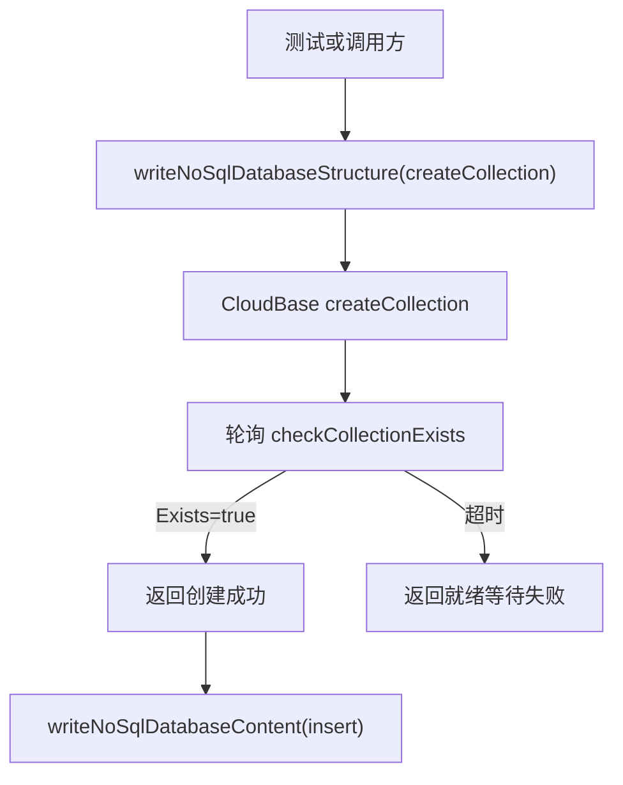

# 技术方案设计

## 概述

问题根因是 `writeNoSqlDatabaseStructure(action="createCollection")` 当前在底层创建接口返回后立即结束，但云端集合的“创建成功”与“可写入”之间存在短暂传播窗口，导致后续 `writeNoSqlDatabaseContent(action="insert")` 可能命中 `Db or Table not exist`。

本次修复将就绪等待放在 NoSQL 工具层，在创建集合成功后主动轮询集合存在性，待集合进入可检查状态后再返回。这样可以同时提升 MCP 真实调用和集成测试稳定性，并且不改变现有 `object/object[]` 参数序列化逻辑。

## 改动范围

1. 在 [`mcp/src/tools/databaseNoSQL.ts`](/Users/bookerzhao/Projects/cloudbase-turbo-delploy/mcp/src/tools/databaseNoSQL.ts) 中为 `createCollection` 增加“集合就绪等待”逻辑。
2. 在同文件内新增小型轮询辅助函数，复用 `checkCollectionExists` 或等价只读能力确认集合已可见。
3. 保持 `insert/update/delete/query` 的对象参数自动序列化逻辑不变。
4. 更新集成测试，验证“创建集合后立即插入”路径稳定通过。

## 详细设计

### 1. 创建集合后的就绪轮询

- `createCollection` 成功后，不立即返回。
- 工具层进入有限次数轮询：
  - 轮询目标：`cloudbase.database.checkCollectionExists(collectionName)`
  - 轮询间隔：短间隔固定等待，例如 `500ms`
  - 最大等待：受控超时，例如 `10s`
- 当 `Exists === true` 时，认为集合已进入基础可用状态，返回成功结果。
- 当超过最大等待时间仍未就绪时，抛出明确错误，包含集合名和超时信息。

### 2. 错误处理策略

- 如果 `createCollection` 本身失败，直接透传底层错误，不吞错。
- 如果轮询阶段出现瞬时只读查询失败：
  - 允许在超时窗口内继续重试。
  - 最终失败时在错误信息中区分“创建失败”与“创建后等待就绪失败”。
- 如果集合已存在：
  - 保持现有上层调用兼容性，不在本次设计中额外改变语义。
  - 真实集成测试仍可按当前方式捕获并继续。

### 3. 测试策略

- 集成测试继续以 [`tests/integration.test.js`](/Users/bookerzhao/Projects/cloudbase-turbo-delploy/tests/integration.test.js) 为主。
- 关键验证路径：
  1. 创建唯一临时集合。
  2. 创建完成后立即执行 `insert`。
  3. 继续执行 query/update/delete，确认对象参数能力未回归。
- 如有必要，可补充一个局部单元测试覆盖轮询辅助函数的超时/成功分支；若当前测试基础设施不便于 mock `@cloudbase/manager-node`，则以现有集成测试作为主要验收手段。

## 架构说明

## 安全性与兼容性

- 本次不引入新的权限范围，仍使用现有 CloudBase Manager 能力。
- 本次不修改 MCP tool schema，因此不会影响现有调用方入参格式。
- 轮询仅发生在 `createCollection` 成功后的短时间窗口，性能影响可控。

## 风险与取舍

- `checkCollectionExists` 返回存在，并不绝对保证所有后续写入路径百分百无延迟，但这是当前可用能力里成本最低、侵入最小、最接近真实就绪信号的方案。
- 若线上平台存在“存在但仍不可写”的极短窗口，后续可再追加对 `insert` 的特定重试；本次先不扩大修复范围，避免把普通写操作变成隐式重试入口。
