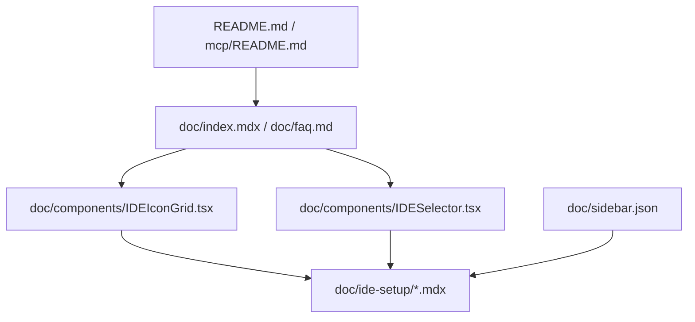

# 技术方案设计

## 概述

本次需求采用“文档与展示层扩展”的实现方式，为 CloudBase AI Toolkit 新增 OpenClaw 支持。OpenClaw 不纳入项目级 MCP 配置文件 IDE 的实现模型，而是作为基于 Skills 的 AI 工具接入场景处理。

核心原则：

- 复用现有文档站的工具展示能力
- 复用 `IDESelector` 的命令安装分支展示 OpenClaw 安装步骤
- 在 README / FAQ / 首页 / Sidebar 中补齐 OpenClaw 入口
- 在所有存在 Cursor 入口的同类组件中补齐 OpenClaw，并将 OpenClaw 排位前置
- 使用 OpenClaw 官方资源作为 logo 来源
- 不修改 `mcp/src/tools/setup.ts`、`config/` 硬链接规则和模板下载映射

## 当前架构

当前仓库中与 AI IDE / AI 工具支持相关的入口主要分为四层：



说明：

- `README.md` 与 `mcp/README.md` 维护仓库对外支持列表
- `doc/index.mdx` 通过 `IDEIconGrid` 展示工具入口
- `doc/ide-setup/*.mdx` 是每个工具的独立配置页
- `IDESelector.tsx` 负责渲染 JSON 配置、CLI 命令安装、一键安装等不同接入模式
- `doc/sidebar.json` 显式维护 IDE 配置页导航顺序

## 技术选型与实现策略

### 1. OpenClaw 建模方式

OpenClaw 作为“命令安装型 AI 工具”接入，而不是“项目级 MCP 配置型 IDE”。

原因：

- issue 讨论与现有仓库口径都指向 Skills 安装而非本地 MCP JSON 文件
- 仓库现有 `cloudbase-guidelines` 模板已明确将 OpenClaw 视为不以 MCP 配置为主的场景
- 若接入 `setup.ts` 的 IDE 模板映射，会导致 `downloadTemplate`、`config/` 和硬链接链路被错误扩展

### 2. 页面与组件复用

OpenClaw 页面采用现有命令行工具文档结构：

- 新增 `doc/ide-setup/openclaw.mdx`
- 复用 `IDESelector`，设置 `defaultIDE="openclaw"`
- 页面内容参考 `doc/ide-setup/openai-codex-cli.mdx`、`doc/ide-setup/opencode.mdx`

`IDESelector.tsx` 中新增一条 OpenClaw 数据：

- `id`: `openclaw`
- `name`: `OpenClaw`
- `platform`: `命令行工具`
- `useCommandInsteadOfConfig`: `true`
- `installCommandDocs`: 以 `npx skills add tencentcloudbase/cloudbase-skills -y` 为主
- `verificationPrompt`: 提供安装后验证 CloudBase 能力的提示词
- 不提供 `configExample`
- 不提供 `supportsProjectMCP`

这样可以直接复用已有的“命令安装说明块”渲染逻辑，避免新增分支。

OpenClaw 独立文档页中补充一条自然语言入口说明：

- 用户也可以直接对 AI 说“安装 CloudBase Skills”
- 文档需说明该说法本质上仍是触发 CloudBase Skills 安装流程
- 命令安装仍作为最明确、最稳定的推荐方式保留

### 3. 文档与导航更新

需要更新的文档入口：

- `README.md`
- `mcp/README.md`
- `doc/index.mdx`
- `doc/faq.md`
- `doc/prompts/how-to-use.mdx`
- `doc/components/IDEIconGrid.tsx`
- `doc/components/IDESelector.tsx`
- `doc/components/ErrorCodeIDEButton.tsx`
- `doc/sidebar.json`
- `doc/ide-setup/openclaw.mdx`

更新策略：

- 在支持列表中补充 OpenClaw 条目，并链接到 `/ai/cloudbase-ai-toolkit/ide-setup/openclaw`
- 在首页卡片入口中补充 OpenClaw
- 在带有热门 IDE 图标或 IDE 列表的组件中补充 OpenClaw，并把顺序排到 Cursor 之前
- 在 FAQ 与 Skills 使用文档中说明 OpenClaw 推荐走 Skills 安装
- 在 OpenClaw 详情页中说明“不需要项目级 MCP 配置文件”

### 4. 排序与 logo 策略

涉及 OpenClaw 的组件需统一遵守以下排序与图标规则：

- OpenClaw 在同类列表中的位置优先于 Cursor
- 若组件本身维护一个“热门 IDE”子集，OpenClaw 也要进入该子集
- logo 优先使用 OpenClaw 官方站点暴露的资源，例如 `https://openclaw.ai/favicon.svg`

这样可以确保站点各处体验一致，不会出现首页有 OpenClaw、错误助手里没有，或者不同组件图标风格不一致的问题。

### 5. Skills 命令口径

通用 Skills 页面与说明文档中统一采用以下推荐命令：

```bash
npx skills add tencentcloudbase/cloudbase-skills
```

OpenClaw 专属章节单独使用：

```bash
npx skills add tencentcloudbase/cloudbase-skills -y
```

原因：

- 通用文档保留交互式选择能力，更适合多工具场景
- OpenClaw 章节强调“一步安装”，`-y` 更符合用户预期
- 这样既满足全局统一口径，也保留 OpenClaw 的更顺滑接入体验

### 6. IDESelector 流程重构

`doc/components/IDESelector.tsx` 当前存在两类不再符合目标工作流的内容：

- 步骤 1 中的 “使用项目模板（推荐）”
- 步骤 2 中的固定验证 prompt 与随机业务 prompt

本次重构方向：

1. 将步骤 1 从“模板 / 配置”导向调整为“安装 CloudBase Skills”导向
2. 将步骤 2 从“验证 MCP + 随机业务 prompt”调整为“CloudBase Skills 两步提示”

新的交互结构：

- 步骤 1：给 AI 一条完整安装 prompt
  - 文案形式为“安装 CloudBase Skills：执行如下命令 npx skills add tencentcloudbase/cloudbase-skills -y”
- 步骤 2：使用 CloudBase Skills + 随机业务 prompt
  - 保留现有随机 prompt 机制
  - 在每条随机业务 prompt 前统一补充“使用 CloudBase Skills”引导语，作为用户真正开始开发的提示词入口

实现层面建议：

- 弱化或移除 `useTemplate` / `templateDescription` 的模板提示块
- 将 `verificationPrompt` 的职责重定义为 “Skills 安装提示”
- 保留当前第二条随机 prompt 的生成逻辑，但为展示文本与深链文本统一追加 “使用 CloudBase Skills” 前缀
- 保留复制按钮与 “Open with Cursor” deep link，但其内容需切换到新的 Skills 流程文案

这样做的结果是 IDESelector 从“底层配置说明器”转向“推荐工作流入口”。

### 7. 不纳入本次变更的部分

以下模块本次不改动：

- `mcp/src/tools/setup.ts`
- `scripts/fix-config-hardlinks.mjs`
- `config/` 下任意 OpenClaw 配置文件或规则硬链接

原因：

- 这些链路服务于“下载到项目目录中的 IDE 配置文件”
- OpenClaw 本次接入方式不依赖项目目录中的 MCP / rules 配置文件
- 强行接入会让 OpenClaw 的产品形态与仓库实现模型产生冲突

## 文案与交互约束

OpenClaw 相关文案需要遵守以下约束：

- 通用 Skills 推荐命令固定为 `npx skills add tencentcloudbase/cloudbase-skills`
- OpenClaw 章节使用 `npx skills add tencentcloudbase/cloudbase-skills -y`
- 可补充自然语言入口 “安装 CloudBase Skills” 作为更低门槛的说明
- 不引导用户手动创建 `.mcp.json` 或其它 IDE 配置文件
- 说明 Skills 与 MCP 的职责区别：
  - Skills 负责 CloudBase 规则、知识和工作流
  - MCP 负责云资源连接与工具调用
- 若提及 OpenClaw 的特殊性，应说明其接入方式不同于 Cursor / Claude Code 这类 MCP 配置型工具

`IDESelector` 相关文案还需遵守：

- 不再默认推荐“使用项目模板（推荐）”
- 不再默认使用“下载 CloudBase AI 开发规则到当前项目”作为第一条验证 prompt
- 第一步 prompt 固定为一条完整的安装 CloudBase Skills prompt
- 第二步 prompt 保留随机业务 prompt，但每条都需以“使用 CloudBase Skills”作为前置引导

## 测试策略

本次以文档与前端静态内容验证为主。

验证项：

1. 文档链接验证
   - OpenClaw 条目在 README、mcp README、首页、Sidebar 中均可访问
   - `/ai/cloudbase-ai-toolkit/ide-setup/openclaw` 页面可正常构建和跳转
2. 组件渲染验证
   - `IDEIconGrid` 正常展示 OpenClaw
   - `IDESelector` 选择 OpenClaw 时显示命令安装文案，而不是 JSON 配置块
   - `IDESelector` 的两步提示流程符合新的 Skills 安装与使用结构
3. 文案一致性验证
   - 通用 Skills 安装口径统一为 `npx skills add tencentcloudbase/cloudbase-skills`
   - OpenClaw 专属章节使用 `npx skills add tencentcloudbase/cloudbase-skills -y`
   - 无错误的 MCP 配置路径描述

建议执行：

- 文档站构建或类型检查命令
- 针对 `IDESelector.tsx` 的本地预览检查
- `rg "openclaw|OpenClaw"` 复核全仓库文案

## 风险与兼容性

主要风险：

- 若将 OpenClaw 混入 MCP 配置型 IDE 列表逻辑过深，后续可能引发用户误配
- 若文档同时出现 `clawhub` 和 `cloudbase-skills` 两套主命令，容易造成口径分裂

缓解方式：

- 通用 Skills 文档统一使用 `npx skills add tencentcloudbase/cloudbase-skills`
- OpenClaw 专属章节统一使用 `npx skills add tencentcloudbase/cloudbase-skills -y`
- 将 OpenClaw 限定在“文档与展示层接入”范围
- 在独立页面中显式声明其与 MCP JSON 配置型 IDE 的差异
