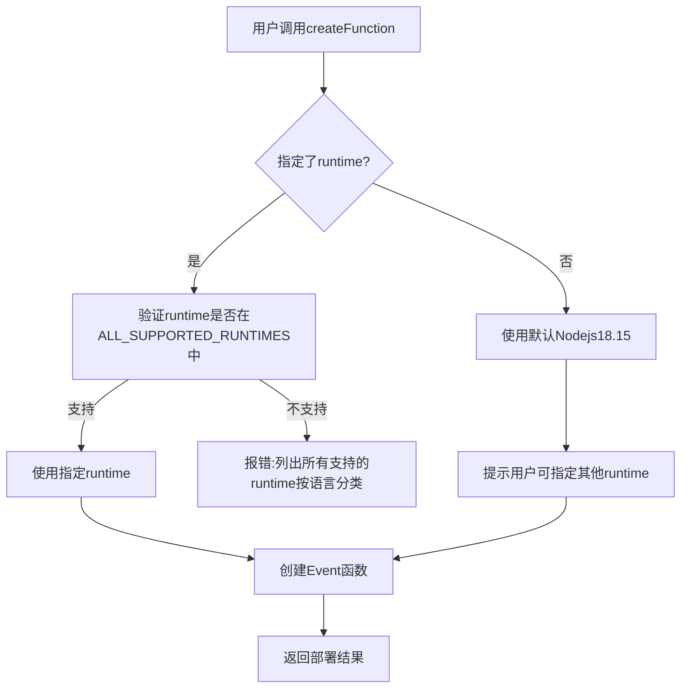

# 技术方案设计 - Python云函数部署支持

## 架构概述

本方案通过移除MCP工具中对运行时环境的不必要限制,实现对Python等多语言云函数的部署支持。核心思路是:

1. **技术验证优先**: 先验证Event函数是否真的支持Python/PHP/Java/Go运行时
2. **移除运行时限制**: 移除代码中仅允许Node.js运行时的验证逻辑
3. **扩展运行时常量**: 添加Python、PHP、Java、Go等运行时环境常量
4. **优化错误提示**: 提供清晰的运行时列表和依赖打包指南
5. **完善文档**: 更新文档说明HTTP函数已支持所有语言,Event函数支持多种运行时

## 技术栈

- **开发语言**: TypeScript
- **核心SDK**: @cloudbase/manager-node
- **文件系统**: Node.js fs/path模块
- **验证库**: Zod (已使用)

## 技术选型

### 方案对比

| 方案 | 优点 | 缺点 | 选择 |
|------|------|------|------|
| 方案1: 移除运行时限制 | 改动小,符合SDK能力,用户体验好 | 需要验证Event函数多语言支持 | ✅ |
| 方案2: 引导使用HTTP函数 | HTTP函数已确认支持所有语言 | 需要生成scf_bootstrap,复杂度高 | 备选 |
| 方案3: 引导用户使用CloudRun | 无需改动 | 用户体验差,不符合轻量级函数场景 | ❌ |

**最终选择**: 方案1 - 移除运行时限制(需先验证Event函数多语言支持)

**备选方案**: 如果验证发现Event函数不支持多语言,则采用方案2,引导用户使用HTTP函数

**理由**:
- CloudBase Manager Node SDK的Event函数原生支持多种运行时
- 当前代码中的限制是不必要的,移除即可
- 改动最小,风险最低
- 用户体验最好,无需区分Event和HTTP函数
- 符合CloudBase官方SDK的设计理念

## 核心功能设计

### 1. 扩展运行时常量

```typescript
// 当前代码(仅Node.js)
export const SUPPORTED_NODEJS_RUNTIMES = [
  "Nodejs20.19",
  "Nodejs18.15",
  "Nodejs16.13",
  "Nodejs14.18",
  "Nodejs12.16",
  "Nodejs10.15",
  "Nodejs8.9",
];

// 修改后(所有运行时)
export const SUPPORTED_RUNTIMES = {
  nodejs: ["Nodejs20.19", "Nodejs18.15", "Nodejs16.13", "Nodejs14.18", "Nodejs12.16", "Nodejs10.15", "Nodejs8.9"],
  python: ["Python3.10", "Python3.9", "Python3.7", "Python3.6", "Python2.7"],
  php: ["Php8.0", "Php7.4", "Php7.2"],
  java: ["Java11", "Java8"],
  golang: ["Golang1"]
};

export const DEFAULT_RUNTIMES = {
  nodejs: "Nodejs18.15",
  python: "Python3.9",
  php: "Php7.4",
  java: "Java11",
  golang: "Golang1"
};

// 所有支持的运行时列表(用于验证)
export const ALL_SUPPORTED_RUNTIMES = Object.values(SUPPORTED_RUNTIMES).flat();
```

### 2. 运行时验证逻辑修改

```typescript
// 当前代码(仅验证Node.js)
if (!isHttpFunction) {
  if (!func.runtime) {
    func.runtime = DEFAULT_NODEJS_RUNTIME;
  }
  if (!SUPPORTED_NODEJS_RUNTIMES.includes(func.runtime)) {
    throw new Error(`不支持的运行时环境: "${func.runtime}"。支持的值：${SUPPORTED_NODEJS_RUNTIMES.join(", ")}`);
  }
}

// 修改后(验证所有运行时)
if (!isHttpFunction) {
  if (!func.runtime) {
    func.runtime = DEFAULT_RUNTIME;
    console.log(`未指定runtime,使用默认值: ${DEFAULT_RUNTIME}。可选运行时: ${formatRuntimeList()}`);
  }
  if (!ALL_SUPPORTED_RUNTIMES.includes(func.runtime)) {
    throw new Error(
      `不支持的运行时环境: "${func.runtime}"。\n` +
      `支持的运行时:\n${formatRuntimeList()}`
    );
  }
}

// 格式化运行时列表(按语言分类)
function formatRuntimeList(): string {
  return Object.entries(SUPPORTED_RUNTIMES)
    .map(([lang, runtimes]) => `  ${lang}: ${runtimes.join(', ')}`)
    .join('\n');
}
```

### 3. 函数创建流程



## 数据库/接口设计

### MCP工具接口变更

**createFunction工具**:
- 保持现有参数不变(向后兼容)
- `runtime`参数描述更新,列出所有支持的运行时(按语言分类)
- 移除仅验证Node.js运行时的逻辑
- 添加对所有运行时的验证逻辑
- 工具描述中添加多语言支持说明和HTTP函数说明
- 错误提示中按语言分类显示支持的运行时

**updateFunctionCode工具**:
- 无需修改,已支持所有运行时

**文档更新**:
- `doc/mcp-tools.md`: 更新runtime参数说明,列出所有支持的运行时
- `config/rules/cloud-functions/rule.md`: 添加多语言支持说明和依赖打包指南

## 测试策略

### 阶段0: 技术验证
- 在测试环境创建Python Event函数,验证是否能成功部署和运行
- 在测试环境创建PHP Event函数,验证是否能成功部署和运行
- 在测试环境创建Java Event函数,验证是否能成功部署和运行
- 在测试环境创建Go Event函数,验证是否能成功部署和运行
- 记录验证结果,如果不支持,调整方案为引导用户使用HTTP函数

### 单元测试
- 运行时验证测试(所有支持的运行时)
- 默认运行时选择测试
- 错误提示格式测试

### 集成测试(需先完成阶段0验证)
- Python Event函数完整部署流程
- PHP Event函数完整部署流程
- Java Event函数完整部署流程
- Go Event函数完整部署流程
- 错误场景处理

### 测试用例
```
tests/python-function-support.test.js
- 测试所有运行时验证通过
- 测试不支持的运行时报错
- 测试默认运行时选择
- 测试错误提示格式(按语言分类)
- 测试Python/PHP/Java/Go Event函数部署(需先验证支持)
```

## 安全性

1. **运行时验证**: 严格验证runtime参数,仅允许官方支持的运行时
2. **路径验证**: 验证functionRootPath防止路径遍历
3. **依赖安全**:
   - Node.js函数自动安装依赖(强制开启installDependency=true)
   - Python/PHP/Java/Go函数需要预先打包依赖,在文档中提供打包指南
4. **向后兼容**: 确保现有Node.js函数不受影响

## 依赖打包指南

### Python函数
```bash
# 在函数目录下安装依赖到本地
pip install -r requirements.txt -t .
```

### PHP函数
```bash
# 使用composer安装依赖
composer install --no-dev
```

### Java函数
```bash
# 使用Maven打包
mvn clean package
# 或使用Gradle打包
gradle build
```

### Go函数
```bash
# 编译为可执行文件
GOOS=linux GOARCH=amd64 go build -o main
```

