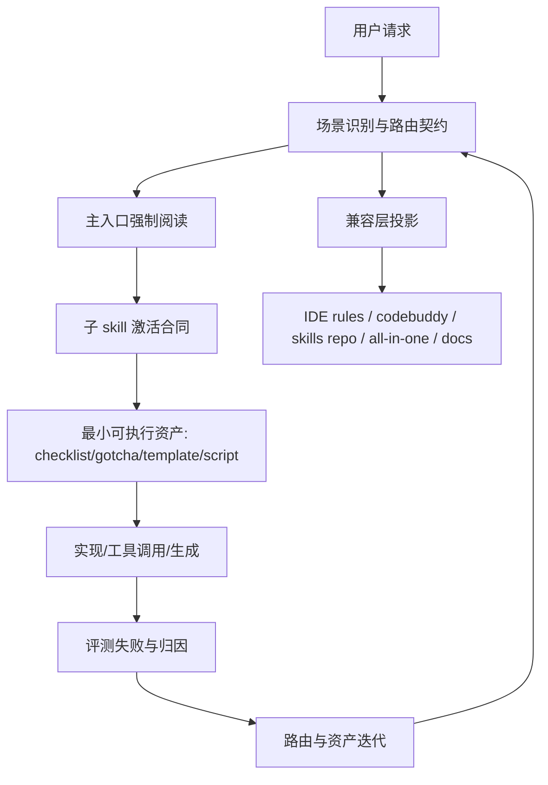

# 技术方案设计

## 设计目标

本方案聚焦解决“知识存在，但 Agent 没有在正确时机读到和用上”的问题。核心目标不是继续堆更多知识，而是在当前仓库里建立一条更稳定的知识激活链路，让 Agent 在进入 CloudBase 任务后，能先命中正确入口、按顺序读取正确参考、避开错误近邻，并在生成产物和兼容层中保持同样的路由语义。

本次设计遵循以下原则：

1. 保持 `config/source/guideline/` 与 `config/source/skills/` 为语义源。
2. 优先强化入口、路由、must-read、do-not-use 和 gotcha，而不是增加冗长正文。
3. 兼容层、文档入口、技能仓库与 all-in-one 产物必须表达一致的激活语义。
4. 先覆盖高频高代价路径，再逐步扩展到次级场景。
5. 不以调整 `scripts/build-allinone-skill.ts` 的全量 references 打包策略作为本轮主方案。

## 非目标

1. 不在本轮重构中减少 all-in-one skill 的 references 数量或修改其整体打包结构。
2. 不尝试一次性重写所有 skill，而是优先处理认证、Web、小程序、云函数、HTTP API、数据库、UI 等高频入口。
3. 不引入新的在线分类服务或复杂运行时组件，仍以仓库内静态规则、技能和生成脚本为主。

## 当前仓库问题分析

### 1. 主入口存在，但“强制路由”不够硬

`config/source/guideline/cloudbase/SKILL.md` 已覆盖 CloudBase 场景识别、技能映射和 MCP 使用原则，但当前文件同时承担了产品介绍、安装说明、能力总览、示例列表和参考导航多个职责。高价值约束虽然存在，但没有形成足够靠前、足够短、足够硬的“先读什么、不要读什么、下一步读什么”结构，导致 Agent 容易在真正开始写代码前就偏航。

### 2. 不同入口的激活强度不一致

`config/source/editor-config/guides/cloudbase-rules.mdc` 与 `config/codebuddy-plugin/rules/cloudbase_rules.md` 中已经有更强的 MUST 级约束，例如 UI 必读、认证先配、模板优先下载、环境先检查等，但这些规则与主 `SKILL.md` 的表达强度并不完全一致。结果是不同 IDE / 不同消费面前，Agent 被引导到正确知识的概率不同。

### 3. 子 skill 更像“内容说明”，还不是统一的“入口合同”

例如 `auth-tool`、`web-development`、`cloud-functions` 等 skill 已经具备较强知识密度，但 skill 顶部缺少统一的激活合同：

- 什么时候它应该成为 first read
- 什么时候它必须在写代码前被读
- 它必须与哪个第二参考联动
- 哪些近邻路径不要用
- 当前场景最常见的误用是什么

这会让 Agent 即使读到了 skill，也未必知道它在当前决策链中的优先级。

### 4. 兼容产物和公开文档还没有共享一套可测试的路由契约

当前有多条传播链路：

- `config/source/guideline/cloudbase/SKILL.md`
- `config/source/editor-config/guides/cloudbase-rules.mdc`
- `config/codebuddy-plugin/rules/cloudbase_rules.md`
- `scripts/skills-repo-template/cloudbase-guidelines/SKILL.md`
- `doc/prompts/how-to-use.mdx`
- `scripts/build-allinone-skill.ts` 生成的 all-in-one skill

这些入口都在讲“如何让 AI 用对 CloudBase”，但没有共享一个明确、可审计、可测试的场景路由契约，因此容易出现语义漂移。

### 5. 当前测试覆盖了构建，不足以覆盖“是否被正确读到”

现有测试如 `tests/build-allinone-skill.test.js`、`tests/build-compat-config.test.js` 更偏向产物结构与拷贝正确性，尚未验证：

- 某类请求应该优先命中哪个 skill
- 某类场景是否存在 must-read 约束
- 某类错误近邻是否被明确禁止
- 同一套路由规则是否在多个兼容面中保持一致

## 目标架构：知识激活链路

该链路由 5 个层次组成。

### 第一层：场景路由契约

新增一个轻量、结构化的路由语义源，例如 `config/source/guideline/cloudbase/activation-map.yaml`，用于描述“哪类用户意图应该先读什么、再读什么、不要读什么”。

建议字段：

- `id`: 场景标识，例如 `web-auth`、`miniapp-auth`、`native-http-api`
- `signals`: 用户请求中的高频触发词或意图模式
- `firstRead`: 首要 skill / guideline
- `thenRead`: 第二参考与第三参考
- `beforeAction`: 在写代码或调用工具前必须完成的检查
- `doNotUse`: 明确不应优先进入的错误近邻
- `commonMistakes`: 当前场景最常见误用
- `priority`: 覆盖优先级

该文件不是为了引入新的知识仓库，而是把“入口路由语义”从大段 prose 中抽离出来，变成一份更容易复用、同步和测试的合同。

首批覆盖场景建议包括：

1. Web 登录 / 注册 / 认证配置
2. 微信小程序登录与数据接入
3. 原生 App / Flutter / React Native 接入 HTTP API
4. Web 文档数据库开发
5. CloudBase MySQL 管理与 Web 接入
6. 云函数开发与部署
7. CloudRun 后端部署
8. Web / 小程序 AI 能力集成
9. 页面 / 组件 / 界面生成时的 UI 设计前置
10. Spec 工作流场景

### 第二层：主入口强化为“先读什么”的总路由器

`config/source/guideline/cloudbase/SKILL.md` 调整为“短入口 + 强路由 + 再展开”的结构，顶部优先保留以下内容：

1. `Start Here` 或 `Activation Contract`
   - CloudBase 任务进入后，先识别场景，再决定 first read
   - 没有完成最小阅读前，不得直接写代码或直接调用 CloudBase API
2. 高优先级场景路由表
   - 请求类型
   - first read
   - then read
   - do not use
   - before action
3. 全局前置规则
   - MCP / mcporter 优先
   - 环境信息检查
   - 模板下载规则
   - 认证配置前置
   - UI 设计前置
4. 语义源优先级
   - `config/source/guideline/` 与 `config/source/skills/` 为主知识源
   - `.generated/`、兼容镜像、IDE 产物、历史模板仅为投影或兼容层，不作为优先知识入口

产品介绍、安装细节、示例列表和扩展说明仍可保留，但整体下沉到后续章节，避免入口信号被稀释。

### 第三层：子 skill 统一为“激活合同 + 资产入口”

对高频 skill 统一增加顶部结构，优先处理以下文件：

- `config/source/skills/auth-tool/SKILL.md`
- `config/source/skills/auth-web/SKILL.md`
- `config/source/skills/web-development/SKILL.md`
- `config/source/skills/miniprogram-development/SKILL.md`
- `config/source/skills/http-api/SKILL.md`
- `config/source/skills/cloud-functions/SKILL.md`
- `config/source/skills/relational-database-tool/SKILL.md`
- `config/source/skills/ui-design/SKILL.md`

统一顶部模板建议为：

- `Use this first when...`
- `Read before writing code if...`
- `Then also read...`
- `Do NOT use for...`
- `Common mistakes / gotchas`
- `Minimal checklist`

这样做的目的不是美化文档结构，而是让每个 skill 自己说明“我在决策链中扮演什么角色”。

例如：

- `auth-tool` 必须明确“只要用户提到登录/注册/认证配置，就要先检查 provider，再写前端代码”
- `web-development` 必须明确“Web 登录不能转去云函数实现认证逻辑”
- `http-api` 必须明确“原生 App 不支持 CloudBase SDK，不要误走 Web SDK 路径”
- `cloud-functions` 必须明确“云函数与 CloudRun 的边界，以及 runtime 不可变限制”

### 第四层：为高频失败场景补充最小可执行资产

对那些已经证明“仅靠 prose 不够”的场景，补充结构化资产，而不是继续往正文加说明。资产形态优先级如下：

1. `gotchas.md`
2. `checklist.md`
3. 最小模板片段
4. 必要时再引入脚本或 helper

首批建议资产：

- 认证配置检查清单：放在 `auth-tool` 相关目录
- Web 登录实现前置清单：放在 `auth-web` 或 `web-development`
- 云函数 runtime / HTTP 函数检查清单：放在 `cloud-functions`
- 原生 App 接入限制清单：放在 `http-api`
- UI 输出前置设计清单：放在 `ui-design`

主 `SKILL.md` 只保留何时使用这些资产、何时强制阅读，避免正文继续膨胀。

### 第五层：兼容层与公开文档对齐同一套路由语义

本层的目标不是统一文件格式，而是统一“激活语义”。需要同步的关键入口如下：

1. `config/source/editor-config/guides/cloudbase-rules.mdc`
   - 用于 Cursor / Windsurf / Cline / Copilot 等兼容链路
   - 这里保留强制语言，但路由顺序、错误近邻和 must-read 必须与主语义源一致
2. `config/codebuddy-plugin/rules/cloudbase_rules.md`
   - 当前该文件的约束强度更高，应改为复用同一套路由契约，而不是独立演化
3. `scripts/skills-repo-template/cloudbase-guidelines/SKILL.md`
   - 对外发布的 skills 仓库入口，需要保留同样的场景路由和前置规则
4. `doc/prompts/how-to-use.mdx`
   - 面向人的使用文档，负责解释如何提升激活率，但内容应引用同一套“推荐 first read / 项目级规则 / hooks”策略，不再只停留在经验描述
5. `scripts/build-allinone-skill.ts` 与 `scripts/sync-codebuddy-plugin.ts`
   - 本轮不改全量打包策略，但需要保证新的主入口路由块、skill 顶部合同和关键 gotcha 在 all-in-one 及 codebuddy 聚合产物中被完整保留

## 仓库落点设计

### 1. 语义源

- `config/source/guideline/cloudbase/SKILL.md`
  - 主入口路由器
- `config/source/guideline/cloudbase/activation-map.yaml`
  - 新增，保存结构化场景路由合同
- `config/source/skills/*/SKILL.md`
  - 高价值 skill 顶部增加统一激活合同
- `config/source/skills/*/(gotchas|checklist|references)`
  - 承载高频失败沉淀资产

### 2. 兼容层与对外投影

- `config/source/editor-config/guides/cloudbase-rules.mdc`
  - 对 IDE 规则兼容产物的主模板
- `config/codebuddy-plugin/rules/cloudbase_rules.md`
  - CodeBuddy 使用的强规则入口
- `scripts/skills-repo-template/cloudbase-guidelines/SKILL.md`
  - 对外技能仓库入口模板
- `doc/prompts/how-to-use.mdx`
  - 面向用户解释如何提高技能触发率与稳定性

### 3. 生成与同步脚本

后续实施阶段可按最小改动原则调整以下脚本：

- `scripts/build-compat-config.mjs`
  - 将主入口规则同步到 IDE 兼容产物
- `scripts/build-allinone-skill.ts`
  - 继续负责聚合，但要保留新的路由结构与关键引用
- `scripts/sync-codebuddy-plugin.ts`
  - 同步新的聚合入口到 codebuddy skill 目录
- `scripts/build-skills-repo.mjs`
  - 确保 skills 仓库入口与主语义源一致
- `scripts/generate-prompts-data.mjs`
  - 如后续需要把激活策略展示到 prompts 文档，可从路由合同中生成部分场景数据

## 验证方案

### 1. 路由契约测试

新增 `tests/skill-activation-routing.test.js`，覆盖以下断言：

1. 高优先级场景在 `activation-map.yaml` 中都有定义。
2. 每个场景都至少声明 `firstRead`、`doNotUse` 与 `beforeAction`。
3. 路由表中的 skill 名称都能在 `config/source/skills/` 中找到。
4. 高冲突场景存在显式边界，例如：
   - Web 认证不得优先走云函数登录实现
   - 原生 App 不得走 Web SDK
   - CloudRun 与云函数要有边界

### 2. 投影一致性测试

扩展现有测试，确保语义在不同产物中不丢失：

- `tests/build-allinone-skill.test.js`
  - 校验聚合后的主入口仍包含关键 must-read 路由
- `tests/build-compat-config.test.js`
  - 校验 IDE 兼容规则中包含关键前置约束
- `tests/sync-codebuddy-plugin.test.js`
  - 校验 codebuddy 聚合产物保留主入口合同

### 3. Prompt Fixture 测试

新增一组场景 fixture，例如：

- “帮我做一个 CloudBase Web 登录页”
- “帮我在 Flutter 里接 CloudBase 登录”
- “帮我部署一个 Python HTTP 后端到 CloudBase”
- “帮我在小程序里接入 CloudBase 文档数据库”

每个 fixture 断言其预期：

- should-route-to
- should-read-first
- should-read-next
- should-not-route-to
- should-check-before-action

这类测试不直接模拟大模型，而是验证仓库中写出来的路由合同足够明确、足够完整、足够一致。

## 迭代与归因闭环

为了让后续 attribution issue 能更稳定地回流到仓库改进，需要把失败归因映射到固定改进动作：

| 归因类型 | 优先改动位置 | 典型动作 |
|---------|-------------|---------|
| 知识缺失 | 对应 skill / checklist / asset | 补充缺失知识或资产 |
| 没读到入口 | 主 guideline / activation-map / 兼容规则 | 加强 first-read 与 before-action |
| 读到了错误近邻 | 主 guideline / 子 skill 顶部合同 | 增加 do-not-use 与边界说明 |
| 信噪比过高 | 主 guideline 顶部结构 / 子 skill 顶部结构 | 上移 must-read，压缩背景内容 |
| 执行偏差 | checklist / 模板 / 脚本 | 降低自由度，增加最小可执行资产 |

后续在处理评测 issue 时，可以直接把问题归到“缺知识”还是“知识没被激活”，并映射到固定修改面，而不是继续泛化为“再补一点文档”。

## 风险与权衡

### 1. 风险：入口规则变强后，正文可能重复

缓解方式：把高价值规则前置为短合同，长解释下沉，避免同一知识在多个段落重复展开。

### 2. 风险：兼容层与语义源再次分叉

缓解方式：尽量把路由语义集中到 `activation-map.yaml` 与主 guideline 中，再由脚本或同步流程投影；至少要用测试锁住关键语义。

### 3. 风险：一次性覆盖太多 skill，实施面过大

缓解方式：首批只做高频入口与高失败成本场景，第二阶段再扩展到 AI、storage、agent 等场景。

## 分阶段实施建议

### 第一阶段：建立主路由与高频 skill 合同

1. 新增 `activation-map.yaml`
2. 重构 `config/source/guideline/cloudbase/SKILL.md` 顶部结构
3. 统一 6 到 8 个高频 skill 的顶部激活合同
4. 为 3 到 5 个高频失败场景补充 checklist / gotcha 资产

### 第二阶段：对齐兼容层与文档入口

1. 同步 `cloudbase-rules.mdc`
2. 同步 `config/codebuddy-plugin/rules/cloudbase_rules.md`
3. 同步 skills repo 模板与 `doc/prompts/how-to-use.mdx`
4. 确保 all-in-one 和 codebuddy 聚合产物完整保留主入口语义

### 第三阶段：补测试与评测闭环

1. 增加 routing contract tests
2. 增加 projection consistency tests
3. 增加 prompt fixtures
4. 将后续 attribution issue 的归因结果回流到 activation-map、skill 顶部合同和 checklist 资产
